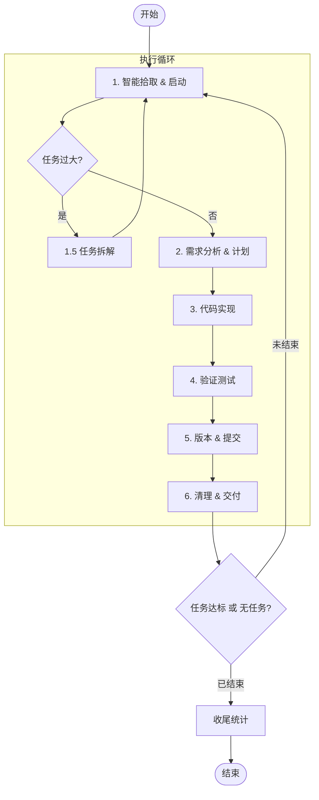

# AI 自动开发流程

> **核心原则**: 严格遵循"环节推进"机制，完成一个环节后，**必须**重新回到此文件查看下一环节的行动指导。

## 核心循环流程图

## 1. 详细执行环节索引

*   [第一阶段：任务启动 (Pick)](develop-flow-01-pick.md)
*   [阶段 1.5：任务拆解 (Decompose - 可选)](develop-flow-01-1-decompose.md)
*   [第二阶段：分析与计划 (Plan)](develop-flow-02-plan.md)
*   [第三阶段：实现与验证 (Do & Check)](develop-flow-03-implement.md)
*   [第四阶段：交付与版本 (Deliver)](develop-flow-04-deliver.md)
*   [第五阶段：清理与循环 (Loop)](develop-flow-05-loop.md)

## 2. 常用命令速查

*   [常用命令速查表](develop-flow-99-commands.md)
