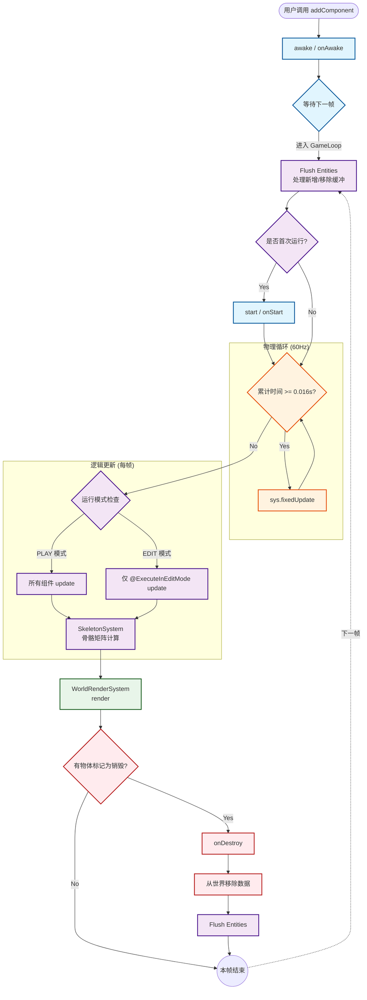

# 生命周期 (Lifecycle)

理解代码的执行顺序对于游戏开发至关重要。以下是 MagicDungeon (`GameWorld` & `SceneSystem`) 的执行时序：

## 初始化阶段

1.  **AddComponent**: 当你调用 `obj.addComponent(new Comp())` 时：
    *   立即调用 `comp.awake()`。
    *   调用 `comp.onAwake()` (这是用户重写的入口)。
    *   该组件被标记为 `isAwake = true`。
    *   该组件被加入 `SceneSystem` 的待 Start 队列。

2.  **Start Phase (首帧)**:
    *   在游戏进入 **PLAY** 模式后的第一帧 Update 开始时。
    *   `SceneSystem` 会清空待 Start 队列，依次调用 `comp.start()` -> `comp.onStart()`。

## 循环阶段

3.  **Fixed Update (物理)**:
    *   基于累积时间 (`fixedUpdateAccumulator`)。
    *   如果累积时间超过 `FIXED_DELTA_TIME` (1/60s)，则循环执行 `sys.fixedUpdate()`。
    *   保证物理逻辑的确定性。

4.  **Update (逻辑)**:
    *   每帧执行一次。
    *   **编辑器模式特例**：在 EDIT 模式下，只有标记了 `@ExecuteInEditMode` 的组件才会执行 `update()`。
    *   **PLAY 模式**：所有激活组件都会执行。

6.  **Render**:
    *   `WorldRenderSystem` 收集所有 `RenderComponent`，按层级排序并绘制。

## 销毁阶段

7.  **Destroy**:
    *   调用 `obj.destroy()` 只是打上标记。
    *   真正的销毁发生在帧末尾 (`SceneSystem.executeDestroyTask`)。
    *   此时会调用 `comp.onDestroy()`，然后从 `ComponentManager` 中注销数据。

## 流程概览
1. **awake:** 最终方法, 组件被添加 (`addComponent`) 时立即执行。用于初始化自身变量。
1. **onAwake:** 可重写方法, 在这里进行组件内部逻辑初始化.
2. **start:** 游戏进入 Play 模式的第一帧执行。用于获取其他组件引用或初始化跨物体逻辑。
3. **onStart:** 可重写方法, 此时所有组件自身初始化完毕, 可以在这里进行组件与物体间初始化逻辑.
3. **fixedUpdate:** 固定时间步长更新 (默认 60次/秒)，用于物理计算。
4. **update:** 逻辑帧, 运行速度与设备帧率一致.
5. **render:** 渲染循环。
6. **destroy:** 物体被销毁时触发。

## 模式区别
*   **EDIT 模式:** 默认不执行 Update，除非组件类标记了 `@ExecuteInEditMode`。
*   **PLAY 模式:** 执行完整的生命周期。

## 核心流程图

## 阶段详解

### 1. 初始化阶段 (Initialization)
*   **Awake**: 当你调用 `addComponent` 时**立即执行**。用于初始化组件内部变量（如 `ArrayList`, `new Fsm()`）。此时无法保证能获取到其他组件。
*   **Start**: 在组件被添加到场景后的**第一帧逻辑开始前**执行。用于获取引用（`getComponent`）或初始化跨物体逻辑。

### 2. 物理阶段 (Physics)
*   **FixedUpdate**: 无论渲染帧率是多少，此方法尽量保证每秒执行 60 次（`FIXED_DELTA_TIME`）。
*   **用途**: 编写与时间相关的稳定逻辑（如移动计算、碰撞检测），避免因帧率波动导致物体穿墙或速度不均。

### 3. 逻辑阶段 (Logic)
*   **Update**: 每一帧都会执行。
*   **Edit Mode**: 编辑器模式下，为了节省性能并防止逻辑乱跑，默认不执行 Update。如果你需要组件在编辑器里也能动（例如自动旋转的展示台），请在类上添加 `@ExecuteInEditMode` 注解。

### 4. 渲染阶段 (Render)
*   **Render**: `WorldRenderSystem` 会收集所有 `RenderComponent`，根据 `sortingLayer` 和 `orderInLayer` 进行排序，然后批量提交给 GPU。

### 5. 销毁阶段 (Decommission)
*   **Destroy**: 当调用 `object.destroy()` 时，物体并不会立即消失，而是被打上“待销毁”标记。
*   **回收时机**: 在当前帧的所有逻辑和渲染结束后，引擎会统一调用 `onDestroy()` 并清理内存。这防止了在遍历列表时删除元素导致的崩溃。

