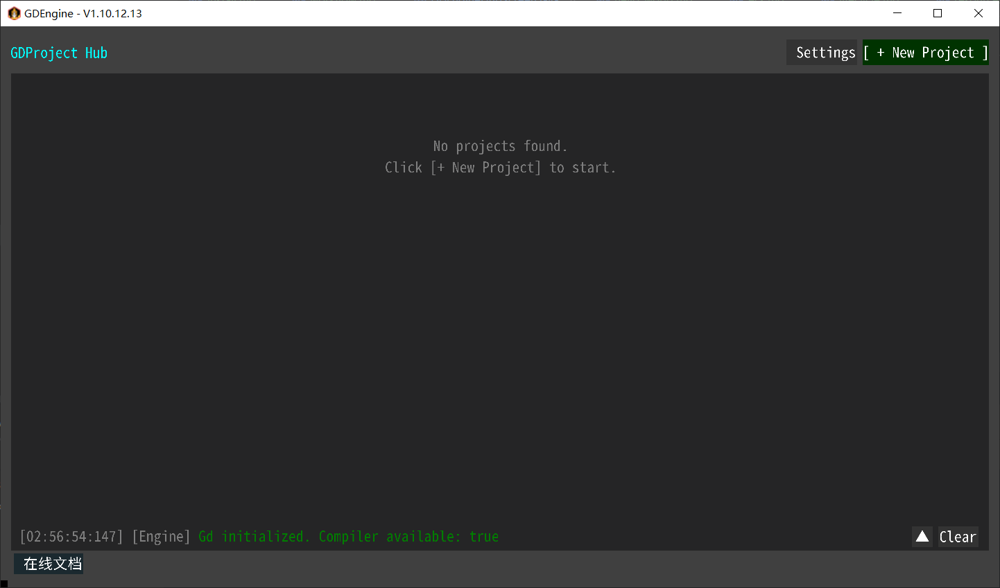

# 引擎工作流 (Hub)

MagicDungeon 使用 **Hub** 作为项目管理中心，类似于 Unity Hub。

## 启动 Hub
运行引擎 Jar 包（或在 IDE 中运行 `Lwjgl3Launcher`），首先进入的就是 **MagicDungeon Hub**。

## 核心功能

## 1. 引擎根目录
首次启动时，引擎会初始化工作空间。
*   **Windows:** 默认为引擎可执行文件所在的**同级目录** (`./MagicDungeon/`).
*   **Android:** 默认为内部存储根目录 (`/sdcard/MagicDungeon/`).

所有项目、模板、配置都存储在此目录下。

## 2. 项目管理
*   **New Project:** 选择标准模板，输入包名，一键生成可运行项目。
*   **Open Project:** 浏览并打开现有的项目文件夹。
*   **Settings:** 修改引擎根目录路径 (高级用户)。

## 3. 目录结构
一个标准的 MagicDungeon 项目包含：
*   `project.json`: 项目元数据（入口类、引擎版本）。
*   `src/main/java/`: 您的 Java 源代码。
*   `assets/`: 图片、音频等资源文件。
*   `libs/`: 引擎自动注入的依赖库（`gdengine.jar` 等）。
