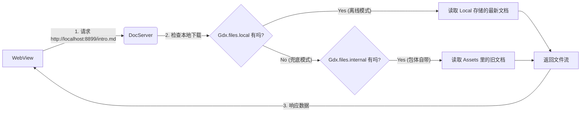

# 讨论历史: 


## V1

- git commit 提交格式  

| 类型 (Type) | 含义 | 归属日志 (Target Log) | 示例 |
| :--- | :--- | :--- | :--- |
| **feat** | 新功能 | **用户日志 (User)** | `feat(editor): 增加FSM可视化编辑器` |
| **fix** | 修复Bug | **用户日志 (User)** | `fix(input): 修复某些情况下鼠标焦点丢失` |
| **perf** | 性能优化 | **双轨 (User & Tech)** | `perf(render): 引入FBO缓存优化渲染` |
| **refactor**| 代码重构 | **技术日志 (Tech)** | `refactor(mvp): 重构EditorController为MVP架构` |
| **chore** | 构建/杂项 | **技术日志 (Tech)** | `chore(gradle): 升级LibGDX版本到1.12.1` |
| **docs** | 文档 | **技术日志 (Tech)** | `docs(readme): 更新API手册链接` |

[User] 修正: 再加个test, 以上已确认

[User]  
- 显示格式化: 对于提交者来说feat: xxx这一行为标题, 然后换行其余所有内容为细节
- 在游戏内显示时(这里已经决定改为内置浏览器网页方式(实现为统一接口然后双端实现内置浏览器))
- 显示项目文档大分类, 里面是引擎内容总览, 开发者文档, 版本更新文档(这个即自动化显示的部分): 
- 我们要根据提交时所处的版本来创建树: 1.10.11 1.10.12...这些是一个page, 折叠内部, 
  - 里面逆序显示每个修订版本更新: 1.10.11.0: feat: xxx\n详细内容: xxx, docs: xx\n内容xxx

- 标记: 就是当前版本, 未来版本, 历史版本
- 用户打开内置浏览器时自动下载然后离线看文档, 这时它可能是旧版了, 也
- 可能我们文档写了一个还未发布的版本的信息, 于是会出现未来版本的内容, 
- 以及比对用户本地和这个文档版本来标记哪个是当前版本内容并自动展开, 
- 过去和未来默认收起, 过去只展示多个版本号列表收起其内容, 
- 我们先做版本日志这一大块, 整个文档的其他部分先做个空架子在那放着)
---

- 当前`git commits 格式检查`hook文件的自动注入任务
```
// ============================================================================
//  Git Hook 自动安装 (配置阶段立即执行)
//  原理：利用 Gradle 配置阶段特性，每次 Sync 或构建前直接写入钩子文件
// ============================================================================

def installGitHooks = { ->
	def gitHooksDir = new File(rootProject.rootDir, '.git/hooks')

	// 1. 安全检查：只有在是 Git 仓库时才执行
	if (!gitHooksDir.exists()) return

	def hookFile = new File(gitHooksDir, 'commit-msg')

	// 2. 定义钩子内容 (Shell Script)
	def rawContent =
		"""#!/bin/sh
# ------------------------------------------------------------------
# Auto-generated by GDEngine Gradle. Do not edit manually.
# ------------------------------------------------------------------

commit_msg_file=\$1
commit_msg=\$(cat "\$commit_msg_file")

# 正则表达式：必须以指定类型开头
# 允许类型: feat, fix, perf, docs, refactor, chore, test
# 格式: type: summary (注意冒号后有空格)
# 可选Scope: type(scope): summary
pattern="^(feat|fix|perf|docs|refactor|chore|test)(\\\\(.+\\\\))?: .+\$"

if ! echo "\$commit_msg" | grep -qE "\$pattern"; then
    echo "❌ [COMMIT REJECTED] 提交格式校验失败！"
    echo "-----------------------------------------------------------------------"
    echo "格式要求: <type>: <summary>"
    echo "          (空行)"
    echo "          <details body...>"
    echo "-----------------------------------------------------------------------"
    echo "✅ feat:     新功能"
    echo "✅ fix:      修复Bug"
    echo "✅ perf:     性能优化"
    echo "✅ docs:     文档/资源更新"
    echo "✅ refactor: 代码重构"
    echo "✅ chore:    构建/依赖/杂务"
    echo "✅ test:     测试用例"
    echo "-----------------------------------------------------------------------"
    echo "示例标题: feat: 增加Web浏览器组件"
    echo "-----------------------------------------------------------------------"
    exit 1
fi
"""
	try {
		// 强制转换为 Unix 换行符 (\n)，防止 Windows \r\n 导致 Shell 脚本报错
		String unixContent = rawContent.replaceAll("\\r\\n?", "\n")

		// 3. 直接写入 UTF-8 字节
		hookFile.setBytes(unixContent.getBytes("UTF-8"))

		hookFile.setExecutable(true)
		println "✅ Git Commit Hook (commit-msg) 已更新 (规则: feat/fix/perf/docs/refactor/chore/test)。"
	} catch (Exception ignored) {
		// 忽略异常，防止非Git环境报错
	}
}

// 立即调用
installGitHooks()
```
[User] 打开内置浏览器时跳转云端文档, 并提供下载按钮可以下载到本地之后可以查看本地文档(其实就是浏览器cookie, 不过对于内置浏览器它的cookie形式我不太清楚以及这种情况是否能用)

- 文档托管: 
  - 项目根目录下的docs/engine_docs/作为文档源, 内部是一整个md目录树, 自动化任务来将此md树变为html形式
  - 托管方案:
    使用 Docsify (极度推荐，无需编译，纯静态 JS 渲染 MD)。
    只需一个 index.html 即可把 /engine_docs 下的所有 Markdown 变成一个漂亮的文档网站。
    在 GitHub 仓库设置中开启 Pages，源选择 /engine_docs。
[User] 这里不确定, 因为github-pages国内访问非常慢, 所以可能要考虑其他网页托管平台最好国内的, 总之要保证访问速度快

- 修改 Gradle:
[User] 修改 engine-tasks.gradle，将 copyChangeLogToAssets 任务取消, 我们不再需要包体assets/内置文档了, (延伸: 甚至以后模板也可能挂载到网页上来在线下载而不是内置到包体assets/里)

一、 整体工作流设计 (The Workflow)
我们的目标是：您只管按规范写 Commit，剩下的（检查、生成日志、发布）全由工具自动完成。
1. 开发阶段 (Input)
   您在 IDE 中修改代码。
   执行 Git Commit。
   Git Hook 介入：本地脚本自动检查 Commit 格式。
   ❌ 格式不对（比如没写前缀）：拒绝提交，提示正确格式。
   ✅ 格式正确：允许提交。
[User] 上面这个检查我支持, 已确定

2. 构建/发布阶段 (Processing)
   您准备发布新版本时，运行一个 Gradle 任务（例如 gradle generateChangelog）。
   脚本逻辑：
   抓取上个版本标签（Tag）到当前的所有 Commit。
   自动分流：根据 Commit 前缀，将日志分发到 changelog_user.json（给用户看）和 changelog_tech.md（给自己看）。
   将生成的日志文件保存到 /docs 目录（用于上传 GitHub）和 /assets 目录（作为本地兜底）。
[User]   
- 这里不对, 我想的是可以在发布时写发布版本号与发布信息, 
- 然后自动更新gradle.properties版本号
  - (这会触发BuildConfig和ReadMe替换更新任务, 
  - 不过之后可能直接集成到发布任务中而不是手动改gradle.properties然后刷新来触发)
- 然后抓取所有上个版本号到这个版本号之间所有Commit来生成总发布信息
  - 包括手动写的总结内容也就是发布信息(给用户看), 
  - 和抓取的所有commit信息的格式化版本(可能要将其格式化为标准文档版本, 或者不格式化因为本来比较标准直接录入?)
- 最主要是我们要保存到docs/engine_docs/下(或者还有个归类目录?还是不, 应该还有个子目录用于归类change_logs/这样)
  - 然后这整个engine_docs/下会有
      1. 引擎总览
      2. 用户手册
      3. 开发者文档
      4. 引擎变更日志
- 然后通过那个Docsify什么的(这个我不太了解啊总之是一个md转html站的工具?)
- 来将engine_docs/下的所有md文件转换为html文件
- 并托管到一个网站上(当然具体是什么还不确定, 看哪个快用哪个)

行动路径建议：
定义 IWebBrowser 接口：这是核心，先在 Core 层把接口定死。
实现 Android 端 WebView：这是移动端的实现。
实现 Desktop 端 WebView：这是 PC 端的实现（这是难点，Lwjgl3 没有原生 WebView，可能需要引入扩展库）。
编写 Gradle 脚本生成 JSON：解析 Git Log 并生成上述 JSON 文件。
编写 HTML 模板：制作一个好看的 HTML/JS 页面，用于在 WebView 里通过 JS 接收 JSON 并渲染成树。

[User]   
- web端需求是确定的, 就是上面那样, 
- 一套接口, 然后平台分别实现浏览器, 
- 但是不要json, 我们已经决定用Docsify的md转html了, 
- 如果顺利, 我们就可以直接用Docsify的html页面来展示整个文档了
- (不过这里我又想到一个东西, 
- 就是咱们是先大版本分类还是说先内容上分类, 
- 比如进去先看到1.10.11...\n1.10.10...
- 还是先看到用户手册/开发者文档/引擎变更日志, 
- 哦我懂了,
  - 引擎总览是顶级的
  - 然后是版本文档
    - 然后分版本(默认展示最新版本文档): 1.10.11...1.10.10, 并可以下拉选择到对应版本查看
    - 然后是每个版本的用户手册/开发者文档/引擎变更日志
- 不对不对, 怎么每个版本都完全写一次
- 应该,,,只有大版本会区分: 比如1.11就是一个可能完全不兼容1.10的大版本所以是两个界面
- 不过现在咱们可能都考虑不到那里, 咱们现在先不做版本区分, 就是一套顶级的用户手册/开发者文档/引擎变更日志, (写上1.10.11来说明截至最新版本就行)
- )


## V2
好的，我们放慢节奏，先进行**深度设计讨论**。您提到的“文档结构设计”确实是重中之重，它决定了后续的自动化逻辑如何编写，以及用户体验是否顺畅。

针对您提出的三个修正点，我逐一解答并展开设计。

---

### 一、 什么是 CI/CD 构建？ (解答)

**CI/CD (持续集成/持续交付)** 在我们这个项目的语境下，指的是**“不需要您手动操作的自动化流水线”**。

*   **现状**：目前您发布版本可能需要：手动改 `BuildConfig` 版本号 -> 手动运行 Gradle 打包 -> 手动写更新日志 -> 手动上传文件。
*   **CI/CD 的愿景**：
	1.  您在本地写好代码，提交 Git Tag (例如 `v1.10.11`)，推送到 GitHub/Gitee。
	2.  **CI (构建)**：云端服务器（如 GitHub Actions）自动检测到新 Tag，自动运行 Gradle 编译，跑通所有测试。
	3.  **CD (交付)**：
		*   自动抓取两次 Tag 之间的所有 Commit。
		*   自动生成 `changelog.json` 和 HTML 文档。
		*   自动把 APK/JAR 和文档发布到下载服务器。
	4.  **结果**：用户打开游戏 Hub，立刻看到新版本提示和新日志，而您除了“推送代码”外，不需要做任何繁琐操作。

---
[User] 这个挺好的, 但是现在还没考虑到那么全的事情, 先不管

### 二、 关于 WebView (确认方案)

既然需求已确定，技术路线锁定为：
*   **核心能力**：`IWebBrowser` 接口。
*   **本地浏览方案**：**LocalHost 策略**。
	*   游戏启动时，内置一个微型 HTTP 服务器 (如 `NanoHTTPD`，非常轻量)。
	*   它将 `assets/docs/` 目录映射为 `http://localhost:port/`。
	*   **优势**：完美解决 WebView 加载本地文件时的跨域 (CORS) 问题，同时支持图片、CSS 引用，且代码逻辑与在线浏览完全一致（都是 HTTP 请求）。

---
[User] 
- 不是assets/docs/, 已经确定不在包体内嵌文档了, 
- 文档源在docs/engine_docs/下, 通过Docsify自动转html, CI/CD自动托管云端网页, 
- 浏览源在云端离线浏览保存在cookie, 
  - 但是cookie方案不可用的话就保存到Gdx.files.local("engine_docs"), 然后通过文件方式加载网页

### 三、 文档结构设计标准 (核心重头戏)

我们要模仿成熟引擎（如 Unity/Godot）的结构，同时结合 GDEngine 的特色。以下是我为您设计的**文档架构蓝图**。

这个结构将直接对应您的 **侧边栏导航树** 和 **文件存储目录**。

#### 1. 顶层导航架构 (The Root)

我们把文档分为四大板块（对应侧边栏的一级菜单）：

1.  **🏠 引擎概览 (General)**
	*   *给初学者看，介绍引擎是什么，怎么安装。*
2.  **📘 开发者手册 (Manual)**
	*   *核心部分，按功能模块分类，教用户怎么用引擎。*
3.  **⚙️ API 参考 (Scripting API)**
	*   *查字典用，类、方法、参数说明。*
4.  **📅 版本日志 (Changelog / Release Notes)**
	*   *按时间倒序排列的更新记录（自动化生成的重点）。*

[User] 嗯说的挺好的, 虽然没有涉及到版本的区分, 但是已经很完善了这个设计

#### 2. 详细目录树设计

```text
Docs/
├── index.html (入口)
├── general/
│   ├── introduction.md      (简介)
│   ├── installation.md      (安装与环境配置: JDK/Android SDK)
│   └── editor_overview.md   (编辑器界面速览)
├── manual/
│   ├── core/                (核心概念)
│   │   ├── ecs_workflow.md  (ECS工作流: World/Entity/Component)
│   │   └── lifecycle.md     (生命周期: Awake/Start/Update)
│   ├── scripting/           (脚本开发)
│   │   ├── creating_scripts.md
│   │   └── event_system.md
│   ├── graphics/            (图形渲染)
│   │   ├── sprites.md
│   │   └── neon_skeleton.md (骨骼动画系统)
│   └── physics/             (物理与数学)
│       └── transform.md
└── changelog/               (由程序自动生成)
    ├── changelog.json       (核心数据源)
    └── index.html           (渲染器)
```

[User]  
- 目录树这块我不清楚, 
- 但肯定的是肯定不会在包体内存这个东西, 
- 如果他说的是源的话, 那我们确实要在项目里写这个源这倒是确定的 


#### 3. 版本日志的“时空折叠”设计 (重点讨论)

您提到的“未来/当前/历史”以及“自动展开”逻辑，需要依赖 **JSON 数据结构** 和 **客户端逻辑** 配合。

**场景模拟：**
*   **用户本地引擎版本**：`1.10.11`
*   **云端文档版本**：`1.10.13` (您已经写了新功能但在内测，还没发给用户)

**界面显示逻辑：**

1.  **🚀 未来版本 (Future)** - *默认折叠*
	*   **1.10.13** `[New]`
	*   **1.10.12** `[New]`
	*   *(提示用户：您的版本过旧，这些是预览内容)*
2.  **✅ 当前版本 (Current)** - ***自动展开***
	*   **1.10.11** `[Installed]`
		*   **1.10.11.2** (Patch)
			*   `fix: 修复输入法焦点`
		*   **1.10.11.0** (Release)
			*   `feat: 增加WebView`
				*   *详细内容：集成了Chromium...*
3.  **📜 历史版本 (History)** - *默认折叠*
	*   **1.10.10**
	*   **1.9.x**

#### 4. 自动化 JSON 数据结构定义

为了支撑上面的显示逻辑，Git Commit 转换成的 `changelog.json` 必须包含以下字段：

```json
{
  "latestVersion": "1.10.13",
  "lastUpdated": "2026-01-16",
  "groups": [
    {
      "version": "1.10.12",
      "date": "2026-02-01", 
      "tag": "v1.10.12",
      "commits": [
        {
          "hash": "a1b2c3d",
          "author": "GoldSprite",
          "type": "feat",
          "scope": "editor",
          "summary": "增加内置浏览器支持", 
          "details": "1. 定义IWebBrowser接口...\n2. Android端实现..." 
        },
        {
          "type": "fix",
          "summary": "修复Inspector刷新闪烁",
          "details": ""
        }
      ]
    },
    {
      "version": "1.10.11",
      "date": "2026-01-15",
      "commits": [...]
    }
  ]
}
```

### 四、 流程总结与确认

**我们将按照以下顺序执行：**

1.  **Gradle 脚本升级**：编写 Groovy 脚本，读取 Git Log，正则解析 `feat: xxx`，生成上述的 `changelog.json`。
2.  **Web 页面开发**：编写一个纯静态的 `changelog.html`，内嵌 JavaScript。
	*   它负责读取 `changelog.json`。
	*   它负责调用 Java 注入的 `getEngineVersion()` 获取本地版本。
	*   它负责执行比对逻辑（未来/当前/历史）并渲染 HTML DOM 树。
3.  **引擎端集成**：实现 WebView 和 LocalServer，加载这个 HTML。

**您现在需要确认的点：**
1.  对于文档目录结构（General, Manual, API, Changelog），是否还需要增加其他一级分类？
2.  对于 Commit 格式 `type: summary \n\n details`，是否同意将 `summary` 作为列表标题，`details` 作为折叠展开后的详细内容？

如果确认无误，我们可以开始着手编写 **生成 Changelog JSON 的 Gradle 脚本**。这将是自动化的第一步。

[User]
- 以上, 先把确定了的部分重新写策划案吧, 未确定的部分以及技术上不清楚的部分再继续讨论


## V3
老师，收到您的详细批阅。您的思路非常清晰：**核心在于将文档视为一个独立发布的Web服务，而非简单的文本文件，引擎只负责“连接”这个服务（在线或本地镜像）。**

根据您的反馈（已确定的 Git 规范、明确的 Docsify 路线、本地存储方案、以及时空折叠的版本展示逻辑），我重新整理了这份 **《GDEngine 文档与自动化日志系统策划案 (v2.0)》**。

这份文档将作为后续开发的**唯一执行标准**。

---

# GDEngine 文档与自动化日志系统策划案 (v3.0)

## 1. 版本控制规范 (已确定)

### 1.1 Git Commit 协议
强制执行标准化的提交格式，既为了代码可读性，也为了自动化脚本能精准抓取数据。

**格式标准：**
```text
<类型>: <简短标题 (Summary)>
(空行)
<详细描述 (Details) - 支持多行/Markdown列表>
```

**类型映射表：**
| 类型 | 含义 | 归属文档板块 |
| :--- | :--- | :--- |
| **feat** | 新功能 | ✨ 新增功能 |
| **fix** | 修复 | 🐛 Bug修复 |
| **perf** | 性能 | ⚡ 性能优化 |
| **docs** | 文档/资源 | 📝 文档与资源 |
| **refactor**| 代码重构 | ♻️ 代码重构 (通常折叠) |
| **chore** | 构建/杂务 | 🔧 构建与杂务 (通常折叠) |
| **test** | 测试 | ✅ 测试 (通常不显示) |

### 1.2 自动化约束 (Git Hook)
*   **动作**：更新 `engine-tasks.gradle`。
*   **逻辑**：在 Gradle 配置阶段自动写入 `.git/hooks/commit-msg`。
*   **校验**：提交时若不符合正则 `^(feat|fix|perf|docs|refactor|chore|test)(\(.+\))?: .+$`，直接拒绝提交并提示标准格式。

---

## 2. 文档工程结构设计 (核心重头戏)

文档不再作为 `assets` 资源，而是作为一个**独立的静态网站项目**存在于源码树中。

### 2.1 目录架构 (`docs/engine_docs/`)
这是 Docsify 的根目录，后续将被转化为 HTML 站点。

```text
GDEngine/
├── docs/
│   └── engine_docs/          <-- 文档源根目录 (GitHub Pages 指向这里)
│       ├── index.html        <-- Docsify 入口 (包含JS配置)
│       ├── _sidebar.md       <-- 侧边栏导航配置
│       ├── _navbar.md        <-- 顶部导航配置
│       ├── coverpage.md      <-- 封面页 (大Logo)
│       │
│       ├── changelog/        <-- [自动化生成区]
│       │   ├── changelog.json  <-- 核心数据：包含所有版本的结构化日志
│       │   └── README.md       <-- 包含一段JS脚本，用于读取JSON并渲染"时空折叠"UI
│       │
│       ├── general/          <-- [1. 引擎总览]
│       │   ├── intro.md
│       │   └── setup.md
│       ├── manual/           <-- [2. 开发者手册]
│       │   ├── ecs.md
│       │   └── scripting.md
│       └── api/              <-- [3. API 参考]
│           └── index.md
└── ...
```

### 2.2 自动化数据流
1.  **Gradle 任务 (`generateChangelog`)**:
	*   读取 Git Tags (如 `v1.10.11`, `v1.10.12`)。
	*   获取 Tag 之间的 Commits。
	*   解析 Commit Message 的 `Header` (标题) 和 `Body` (细节)。
	*   生成/更新 `docs/engine_docs/changelog/changelog.json`。

### 2.3 JSON 数据结构标准
为了支持您的“未来/当前/历史”判断，JSON 必须包含版本号和日期。

```json
{
  "latestVersion": "1.10.13",
  "updateTime": "2026-01-16",
  "versions": [
    {
      "id": "1.10.12",
      "date": "2026-02-01",
      "tag": "v1.10.12",
      "changes": [
        {
          "type": "feat",
          "title": "增加Web浏览器组件",
          "details": "1. 定义IWebBrowser接口...\n2. Android端实现..."
        }
      ]
    },
    {
      "id": "1.10.11", 
      "date": "2026-01-15",
      "tag": "v1.10.11",
      "changes": [...]
    }
  ]
}
```

---

## 3. 运行时集成方案 (Web Browser)

游戏内不直接解析 Markdown，而是内嵌一个浏览器窗口，加载上述 Docsify 站点。

### 3.1 核心接口 (`core`)
```java
public interface IWebBrowser {
    /** 
     * 打开浏览器 
     * @param url 目标地址
     * @param localVersion 传入当前引擎版本号 (用于页面高亮"当前版本")
     */
    void openDocs(String url, String localVersion);
}
```

### 3.2 双端实现策略
*   **Android**: 使用原生 `WebView` (XML布局或动态添加)。
*   **Desktop (Lwjgl3)**:
	*   *方案A (简单)*: 调用 `Gdx.net.openURI()` 唤起系统默认浏览器（Chrome/Edge）。
	*   *方案B (内嵌)*: 集成 `JCEF` (Chromium Embedded Framework) 或 `JavaFX WebView`。*(注：考虑到维护成本，建议初期使用方案A，后期考虑方案B)*。

### 3.3 离线/在线 混合加载逻辑 (Load Strategy)

这是满足您“下载离线看”需求的关键流程：

1.  **检查云端连接**: 尝试 `HEAD` 请求访问云端 `index.html`。
2.  **成功 (Online)**:
	*   直接加载 `https://your-site.com/engine_docs/index.html?v=1.10.11`。
	*   URL 参数 `v=...` 告诉网页哪个是当前版本。
	*   *后台静默下载*: 将整个 `engine_docs` 站点资源下载到 `Gdx.files.local("engine_docs")` 更新本地缓存。
3.  **失败 (Offline)**:
	*   检查本地 `Gdx.files.local("engine_docs/index.html")` 是否存在。
	*   **启动微型服务器**: 启动 `NanoHTTPD` 绑定随机端口 (如 8899)，根目录指向本地文件夹。
	*   加载 `http://localhost:8899/index.html?v=1.10.11`。

---

## 4. "时空折叠" UI 逻辑 (前端实现)

这部分逻辑写在 `docs/engine_docs/changelog/README.md` 中嵌入的 `<script>` 里。Docsify 渲染该页面时会执行 JS。

**渲染逻辑 (伪代码):**

1.  **获取参数**:
	*   `clientVer` = URL参数中的版本号 (例如 "1.10.11")。
	*   `data` = 读取 `changelog.json`。

2.  **遍历 `data.versions`**:
	*   **If `ver.id` > `clientVer`**:
		*   标记为 **[未来版本] (Future)**。
		*   样式：半透明，标题右侧加 `🚀 Preview` 标签。
		*   状态：`Collapsed` (折叠)。
	*   **If `ver.id` == `clientVer`**:
		*   标记为 **[当前版本] (Current)**。
		*   样式：高亮边框，标题右侧加 `✅ Installed` 标签。
		*   状态：`Expanded` (自动展开)，并滚动到视野中心。
	*   **If `ver.id` < `clientVer`**:
		*   标记为 **[历史版本] (History)**。
		*   样式：灰色文本。
		*   状态：`Collapsed` (折叠)。

---

## 5. 待讨论与确认的技术盲点

在开始执行前，我们需要最后确认以下几个技术细节：

1.  **Docsify 的熟悉度**: 您是否需要我提供 Docsify 的基础配置模板（index.html, _sidebar.md）？
2.  **NanoHTTPD 引入**: 为了实现 Android/Desktop 通用的离线浏览，我们需要引入 `org.nanohttpd:nanohttpd` 库 (很小，约 50KB)。您是否同意引入此依赖？
3.  **Gradle 生成 JSON**: 目前我们没有基于 Git Log 生成 JSON 的脚本。这需要编写一段 Groovy 代码调用 `git log` 命令并解析输出。这是**第一步**要解决的难点。

**如果策划案无误，请指示下一步行动：**
*   **选项 A**: 先更新 `engine-tasks.gradle` 中的 Git Hook，确保从现在开始的 Commit 都是规范的。
*   **选项 B**: 先搭建 `docs/engine_docs` 的目录结构和 Docsify 基础文件，让我看看效果。
*   **选项 C**: 先编写 Gradle 脚本，尝试从 Git Log 生成 `changelog.json` (即使现在数据不多)。


## V3-Fix
- 我们边做边修正吧
  - 首先完成基本确定需求的内置Web, 
  - 不过这个还有个不确定的, 
    - 就是我说的离线问题, 
    - 咱们是直接cookie还是localStorage?, 
    - 这取决于实现的内置WebView有多少功能,能否还原完整的浏览器功能, 包括cookie, 
  - 如果不行, 咱们就只能做存储到Gdx.files.local位置, 然后用微型 HTTP 服务器来解决跨域浏览了

### 执行1
老师，您的决策非常务实。**“边做边修正”** 是软件工程中避免过度设计的最佳策略。

关于您提出的**离线存储**核心疑点，我的技术判断如下：

### 核心决策：放弃 Cookie/LocalStorage，采用“文件系统 + 微型服务器”

**结论：** 我们必须采用 **`Gdx.files.local` 存储文件 + `NanoHTTPD` 本地服务器** 的方案。

**理由 (Why):**
1.  **域隔离 (Domain Isolation)**: 浏览器的 `localStorage` 是基于域名的。`https://gitee.com/docs` 和 `file:///android_asset/docs` 是两个完全隔离的世界，数据无法互通。如果不启服务器，您在本地无法读取云端写入的状态。
2.  **容量限制**: LocalStorage 通常限制 5MB，Cookie 仅 4KB。存不下整个引擎文档（包含图片）。
3.  **CORS (跨域)**: 直接用 WebView 打开本地 HTML 文件 (`file://`) 请求外部 JSON 或本地其他目录资源时，现代 WebView 会有非常严格的安全限制，导致加载失败。
4.  **控制权**: 使用 Java 层 (`Gdx.net`) 下载文档包到本地磁盘，比依赖 WebView 内部的缓存机制要可靠得多，且完全可控（进度条、断点续传、版本校验）。

---

### 第一阶段行动：构建浏览器基础架构

我们现在不谈复杂的 JSON 生成和服务器，**先迈出第一步：让引擎拥有“打开网页”的能力。**

我们将在 `core` 层定义接口，并分别在 Android (内嵌WebView) 和 Desktop (调用系统浏览器) 实现它。

*(注：Desktop 端集成内嵌 CEF/Chromium 极为沉重且复杂，通常 99% 的 LibGDX 桌面应用都选择调用系统默认浏览器，体验更流畅且不增加包体积。我们先按此实现，后续有强需求再改)*

#### 1. 定义核心接口

请在 `core` 模块创建新包 `com.goldsprite.magicdungeon.core.web`。

**文件 1: `core/src/main/java/com/goldsprite/gdengine/core/web/IWebBrowser.java`**

```java
package com.goldsprite.magicdungeon.core.web;

/**
 * 跨平台 Web 浏览器接口
 * <p>
 * 职责：统一不同平台的网页浏览行为。
 * </p>
 */
public interface IWebBrowser {
    /**
     * 打开指定 URL
     * @param url 目标地址 (http://... 或 http://localhost:port/...)
     * @param title 窗口标题 (仅 Android/内嵌模式有效)
     */
    void openUrl(String url, String title);

    /**
     * 关闭浏览器 (仅内嵌模式有效)
     */
    void close();
    
    /**
     * 是否支持内嵌浏览
     * @return true=内嵌(Android), false=外部跳出(Desktop)
     */
    boolean isEmbedded();
}
```

**文件 2: `core/src/main/java/com/goldsprite/gdengine/core/Gd.java` (追加字段)**

我们需要在全局入口 `Gd` 中增加这个服务的引用。

```java
// ... existing code ...
public class Gd {
    // ... existing fields ...

    /** 全局浏览器服务 */
    public static IWebBrowser browser; // [New]

    public static void init(Mode runMode, Input inputImpl, Graphics graphicsImpl, IScriptCompiler compilerImpl) {
        // ... existing code ...
        
        // 默认实现：兜底使用 Gdx.net.openURI (防空指针)
        if (browser == null) {
            browser = new IWebBrowser() {
                @Override public void openUrl(String url, String title) { Gdx.net.openURI(url); }
                @Override public void close() {}
                @Override public boolean isEmbedded() { return false; }
            };
        }
    }
    
    // [新增] 允许平台层注入实现
    public static void setWebBrowser(IWebBrowser browserImpl) {
        browser = browserImpl;
    }
}
```

---

#### 2. Android 端实现 (真正的内嵌 WebView)

在 Android 端，我们使用一个 `Dialog` 或者新的 `Activity` 来承载 `WebView`。为了轻量化，这里推荐使用全屏 `Dialog`。

**文件 3: `android/src/main/java/com/goldsprite/gdengine/android/AndroidWebBrowser.java`**

```java
package com.goldsprite.magicdungeon.android;

import android.app.Activity;
import android.app.Dialog;
import android.graphics.Color;
import android.view.View;
import android.view.ViewGroup;
import android.view.Window;
import android.view.WindowManager;
import android.webkit.WebChromeClient;
import android.webkit.WebSettings;
import android.webkit.WebView;
import android.webkit.WebViewClient;
import android.widget.FrameLayout;
import android.widget.ImageButton;
import android.widget.LinearLayout;
import android.widget.TextView;

import com.goldsprite.magicdungeon.core.web.IWebBrowser;

public class AndroidWebBrowser implements IWebBrowser {
    private final Activity activity;
    private Dialog webDialog;
    private WebView webView;

    public AndroidWebBrowser(Activity activity) {
        this.activity = activity;
    }

    @Override
    public void openUrl(String url, String title) {
        activity.runOnUiThread(() -> showWebDialog(url, title));
    }

    @Override
    public void close() {
        if (webDialog != null && webDialog.isShowing()) {
            webDialog.dismiss();
        }
    }

    @Override
    public boolean isEmbedded() {
        return true;
    }

    private void showWebDialog(String url, String title) {
        if (webDialog == null) {
            initDialog();
        }
        
        // 更新标题
        if (webDialog.findViewById(101) instanceof TextView) {
            ((TextView) webDialog.findViewById(101)).setText(title);
        }

        webView.loadUrl(url);
        webDialog.show();
    }

    private void initDialog() {
        webDialog = new Dialog(activity, android.R.style.Theme_Black_NoTitleBar_Fullscreen);
        webDialog.requestWindowFeature(Window.FEATURE_NO_TITLE);
        
        // 根布局
        LinearLayout root = new LinearLayout(activity);
        root.setOrientation(LinearLayout.VERTICAL);
        root.setBackgroundColor(Color.WHITE);

        // 1. 顶部栏 (Toolbar)
        LinearLayout toolbar = new LinearLayout(activity);
        toolbar.setOrientation(LinearLayout.HORIZONTAL);
        toolbar.setBackgroundColor(Color.parseColor("#333333"));
        toolbar.setPadding(20, 20, 20, 20);
        
        // 关闭按钮
        TextView closeBtn = new TextView(activity);
        closeBtn.setText("❌ 关闭");
        closeBtn.setTextColor(Color.WHITE);
        closeBtn.setTextSize(16);
        closeBtn.setOnClickListener(v -> close());
        
        // 标题
        TextView titleView = new TextView(activity);
        titleView.setId(101); // ID便于查找
        titleView.setText("Docs");
        titleView.setTextColor(Color.CYAN);
        titleView.setTextSize(16);
        titleView.setPadding(40, 0, 0, 0);
        
        toolbar.addView(closeBtn);
        toolbar.addView(titleView);
        
        // 2. WebView
        webView = new WebView(activity);
        WebSettings settings = webView.getSettings();
        settings.setJavaScriptEnabled(true); // 必须开启JS
        settings.setDomStorageEnabled(true); // 开启DOM存储(可选)
        settings.setAllowFileAccess(true);   // 允许访问文件(为离线做准备)
        
        // 设置 Client 防止跳转到系统浏览器
        webView.setWebViewClient(new WebViewClient());
        webView.setWebChromeClient(new WebChromeClient());

        // 布局参数
        LinearLayout.LayoutParams webParams = new LinearLayout.LayoutParams(
            ViewGroup.LayoutParams.MATCH_PARENT, 
            ViewGroup.LayoutParams.MATCH_PARENT
        );
        
        root.addView(toolbar);
        root.addView(webView, webParams);

        webDialog.setContentView(root);
        
        // 物理返回键处理
        webDialog.setOnCancelListener(dialog -> {
            if (webView.canGoBack()) {
                webView.goBack();
            } else {
                dialog.dismiss();
            }
        });
    }
}
```

**注入点：`AndroidGdxLauncher.java`**

```java
// 在 onCreate 里的 injectCompilerAndStart() 或 startEngine() 调用之前：
// Gd.setWebBrowser(new AndroidWebBrowser(this));
```

---

#### 3. Desktop 端实现 (系统浏览器)

**文件 4: `lwjgl3/src/main/java/com/goldsprite/gdengine/lwjgl3/DesktopWebBrowser.java`**

```java
package com.goldsprite.magicdungeon.lwjgl3;

import com.badlogic.gdx.Gdx;
import com.goldsprite.magicdungeon.core.web.IWebBrowser;

public class DesktopWebBrowser implements IWebBrowser {
    @Override
    public void openUrl(String url, String title) {
        // Desktop 端暂时调用系统浏览器
        // 优点：性能好，兼容性好，无需额外巨大的依赖库
        Gdx.net.openURI(url);
    }

    @Override
    public void close() {
        // 系统浏览器无法由程序关闭
    }

    @Override
    public boolean isEmbedded() {
        return false;
    }
}
```

**注入点：`Lwjgl3Launcher.java`**

```java
// 在 createApplication() 中：
private static Lwjgl3Application createApplication() {
    DesktopScriptCompiler compiler = new DesktopScriptCompiler();
    
    // [新增] 注入浏览器实现
    Gd.setWebBrowser(new DesktopWebBrowser());

    return new Lwjgl3Application(new GdxLauncher(compiler), getDefaultConfiguration());
}
```

---

### 下一步行动建议

1.  **应用上述代码**：创建接口文件，并分别在 Android 和 Lwjgl3 模块实现并注入。
2.  **验证**：在游戏主界面的 `HubViewImpl` 中，修改那个 "更新日志" 按钮的点击事件：
	```java
	btnLog.addListener(new ClickListener() {
		@Override
		public void clicked(InputEvent event, float x, float y) {
			// 暂时测试百度，看 Android 端是否弹出 Dialog，PC 端是否弹出 Chrome
			Gd.browser.openUrl("https://www.baidu.com", "测试浏览器");
		}
	});
	```
3.  **验证通过后**：我们进入 **Phase 2** —— 引入 `NanoHTTPD` 并编写 HTML 模板，实现真正的“引擎文档结构”。

您同意先执行这第一阶段的代码吗？


### 已执行完成

### 下一阶段
老师，您的理解完全正确！我们确实是在构建一个**“双模引擎”**。

关于您问的 **3. DocServer 的具体工作方式**，它是这样运作的：

### DocServer 核心机制图解



**简单说**：它就是一个“翻译官”。WebView 听不懂 `Gdx.files` 的语言，只听得懂 `HTTP`。`DocServer` 把本地文件“伪装”成网络数据流喂给 WebView。

---

### 开始行动：Phase 2 - 本地服务与文档架构

我们将分四步走。请按顺序操作。

#### 第一步：引入 NanoHTTPD 依赖

修改 **`core/build.gradle`**，在 `dependencies` 块中添加：

```groovy
dependencies {
    // ... 原有依赖 ...
    
    // [New] 轻量级 HTTP 服务器 (用于本地文档预览)
    api 'org.nanohttpd:nanohttpd:2.3.1'
}
```

*操作后请 Sync Gradle。*

#### 第二步：配置 Android 网络安全策略

这是为了替换掉那个不安全的 `usesCleartextTraffic="true"`。

1.  **新建文件**：`android/src/main/res/xml/network_security_config.xml` (如果没有 xml 目录请新建)

```xml
<?xml version="1.0" encoding="utf-8"?>
<network-security-config>
    <!-- 1. 默认策略：禁止明文 HTTP，强制 HTTPS -->
    <base-config cleartextTrafficPermitted="false" />

    <!-- 2. 例外策略：允许 Localhost 使用 HTTP (为了 DocServer) -->
    <domain-config cleartextTrafficPermitted="true">
        <domain includeSubdomains="true">localhost</domain>
        <domain includeSubdomains="true">127.0.0.1</domain>
    </domain-config>
</network-security-config>
```

2.  **修改清单**：`android/src/main/AndroidManifest.xml`

```xml
<application
    ...
    android:name="com.goldsprite.magicdungeon.android.AndroidGdxLauncher"
    android:label="@string/app_name"
    android:icon="@drawable/ic_launcher"
    
    <!-- [修改] 移除 android:usesCleartextTraffic="true" -->
    <!-- [新增] 引用安全配置文件 -->
    android:networkSecurityConfig="@xml/network_security_config"
    ...>
```

#### 第三步：实现 DocServer 逻辑

新建文件 **`core/src/main/java/com/goldsprite/gdengine/core/web/DocServer.java`**

```java
package com.goldsprite.magicdungeon.core.web;

import com.badlogic.gdx.Gdx;
import com.badlogic.gdx.files.FileHandle;
import com.goldsprite.magicdungeon.log.Debug;

import fi.iki.elonen.NanoHTTPD;

import java.io.IOException;
import java.io.InputStream;

/**
 * 本地文档服务器 (Micro HTTP Server)
 * 职责：将 Gdx.files 本地文件映射为 HTTP 流，供 WebView 访问。
 */
public class DocServer extends NanoHTTPD {

    private static final int PORT = 8899;
    private static DocServer instance;
    
    // 文档在文件系统中的相对根路径
    // 对应 Gdx.files.local("docs/engine_docs") 或 internal("docs/engine_docs")
    private static final String DOC_ROOT = "docs/engine_docs";

    private DocServer() {
        super(PORT);
    }

    public static void startServer() {
        if (instance == null) {
            instance = new DocServer();
            try {
                instance.start(NanoHTTPD.SOCKET_READ_TIMEOUT, false);
                Debug.logT("DocServer", "✅ 服务启动: " + getIndexUrl());
            } catch (IOException e) {
                Debug.logErrT("DocServer", "启动失败: " + e.getMessage());
            }
        }
    }

    public static void stopServer() {
        if (instance != null) {
            instance.stop();
            instance = null;
            Debug.logT("DocServer", "服务已停止");
        }
    }
    
    public static String getIndexUrl() {
        return "http://localhost:" + PORT + "/index.html";
    }

    @Override
    public Response serve(IHTTPSession session) {
        String uri = session.getUri();
        
        // 1. 默认页处理
        if (uri.equals("/") || uri.isEmpty()) {
            uri = "/index.html";
        }
        
        // 2. 路径清洗
        if (uri.startsWith("/")) uri = uri.substring(1);
        // 防止路径遍历攻击 (简单的防御)
        if (uri.contains("..")) return newFixedLengthResponse(Response.Status.FORBIDDEN, MIME_PLAINTEXT, "Forbidden");

        String path = DOC_ROOT + "/" + uri;
        
        // 3. 资源查找策略: 优先 Local (下载的), 其次 Internal (自带的)
        FileHandle file = Gdx.files.local(path);
        
        if (!file.exists()) {
            file = Gdx.files.internal(path);
        }

        // 4. 响应文件的内容
        if (file.exists() && !file.isDirectory()) {
            String mime = getMimeTypeForFile(uri);
            try {
                return newChunkedResponse(Response.Status.OK, mime, file.read());
            } catch (Exception e) {
                return newFixedLengthResponse(Response.Status.INTERNAL_ERROR, MIME_PLAINTEXT, "File Read Error");
            }
        } else {
            return newFixedLengthResponse(Response.Status.NOT_FOUND, MIME_PLAINTEXT, "404 Not Found: " + uri);
        }
    }
    
    private String getMimeTypeForFile(String uri) {
        if (uri.endsWith(".html")) return MIME_HTML;
        if (uri.endsWith(".css")) return "text/css";
        if (uri.endsWith(".js")) return "application/javascript";
        if (uri.endsWith(".json")) return "application/json";
        if (uri.endsWith(".png")) return "image/png";
        if (uri.endsWith(".jpg") || uri.endsWith(".jpeg")) return "image/jpeg";
        if (uri.endsWith(".md")) return "text/markdown"; // Docsify 核心文件
        return MIME_PLAINTEXT;
    }
}
```

#### 第四步：建立文档骨架 (Skeleton)

为了让 Server 有东西可展示，我们需要在项目根目录创建真实的文档结构。

请在项目根目录下（与 `core`, `android` 同级）创建目录 `docs/engine_docs`，并新建以下 3 个文件：

**1. `docs/engine_docs/index.html`** (Docsify 入口)
```html
<!DOCTYPE html>
<html>
<head>
  <meta charset="UTF-8">
  <title>GDEngine Docs</title>
  <meta name="viewport" content="width=device-width, initial-scale=1.0, minimum-scale=1.0">
  <!-- 暂时使用 CDN，后续可下载到本地实现真离线 -->
  <link rel="stylesheet" href="https://cdn.jsdelivr.net/npm/docsify@4/lib/themes/dark.css">
</head>
<body>
  <div id="app">正在加载文档引擎...</div>
  <script>
    window.$docsify = {
      name: 'GDEngine',
      repo: '',
      loadSidebar: true,
      subMaxLevel: 2,
      relativePath: true // 关键：开启相对路径支持
    }
  </script>
  <script src="https://cdn.jsdelivr.net/npm/docsify@4/lib/docsify.min.js"></script>
</body>
</html>
```

**2. `docs/engine_docs/README.md`** (默认首页)
```markdown
# GDEngine 开发者中心

欢迎使用 GDEngine！这是本地离线文档服务。

- [快速开始](general/intro.md)
- [API 参考](api/index.md)
- [版本日志](changelog/README.md)
```

**3. `docs/engine_docs/_sidebar.md`** (侧边栏导航)
```markdown
* 概览
  * [简介](README.md)

* 开发者手册
  * [待补充](manual/placeholder.md)

* 更新日志
  * [版本历史](changelog/README.md)
```

---

### 第五步：联调验证 (Verification)

最后，我们在 Hub 界面把那个按钮接上，进行一次完整的跑通测试。

修改 **`core/src/main/java/com/goldsprite/gdengine/screens/ecs/hub/mvp/HubViewImpl.java`**：

```java
// ... imports ...

// 在 initMainLayout() 方法中：

VisTextButton btnLog = new VisTextButton("📅 文档中心");
        btnLog.

setColor(Color.SKY);
        btnLog.

addListener(new ClickListener() {
    @Override
    public void clicked (InputEvent event,float x, float y){
        // 1. 启动本地服务器
        DocServer.startServer();

        // 2. 调用浏览器打开 http://localhost:8899/index.html
        if (Gd.browser != null) {
            Gd.browser.openUrl(DocServer.getIndexUrl(), "GDEngine Docs");
        }
    }
});
```

---

### 请执行

1.  按上述步骤修改代码和创建文件。
2.  运行 Desktop 版：点击按钮，应该会调用 Chrome 打开 `localhost:8899`，显示 Docsify 的黑色主题界面。
3.  运行 Android 版：点击按钮，应该会弹出全屏 WebView，竖屏显示同样的文档界面。

**完成后，请 Commit 并告诉我测试结果，我们就可以向最终的自动化 JSON 生成进发了！**


### 下一阶段
老师，收到。代码检阅完毕。

您对 `AndroidWebBrowser` 的按键拦截修复非常标准，`PlatformImpl` 的路径修正也符合 Android 实际文件系统规律（`Gdx.files.external` 在新版安卓确实由于沙盒机制变得难以预测，使用 `absolute` 配合确定的路径是正解）。

**⚠️ 唯一的一个技术隐患（请确认）：**

在 `DocServer.java` 中：
```java
// 2. 其次检查内部 Assets (assets/docs/engine_docs/...)
FileHandle localFile = Gdx.files.local(RELATIVE_PATH + "/" + uri); 
// ...
} else if (localFile.exists() ...) {
    target = localFile;
    Debug.logT("DocServer", "Found in Internal: " + target.path()); 
}
```
*   **问题**：您代码里写的是 `Gdx.files.local`，但日志打印的是 "Found in Internal"。
*   **Android 端差异**：
	*   `Gdx.files.internal`: 读取 **APK 包内 `assets` 文件夹**（只读）。
	*   `Gdx.files.local`: 读取 **App 私有数据目录** (`/data/user/0/...`)。
*   **风险**：如果您没有编写代码在启动时将 assets 复制到 local，那么 `Gdx.files.local` 默认是空的。**如果您希望兜底读取包体自带的文档，这里应该用 `Gdx.files.internal`。**

---

### 下一步讨论：Phase 3 —— “数据源与自动化”

既然“容器”（浏览器+服务器）已经就绪，现在的核心问题是**“内容从哪来”**。

我们需要讨论并确定以下 **3 个环节** 的实现细节，请您决策：

#### 议题 1：版本日志的数据源格式 (JSON生成)

我们要编写 Gradle 脚本读取 Git Log。为了支持您想要的“树形结构 + 逆序 + 时空折叠”，我们需要确定 JSON 的结构。

**方案 A (推荐)：**
```json
{
  "updateTime": "2026-01-16",
  "versions": [
    {
      "id": "1.10.12",       // 版本号
      "tag": "v1.10.12",     // Git Tag
      "date": "Unreleased",  // 日期
      "type": "future",      // 标记：future/current/history (由Gradle生成时判断? 还是前端判断?) -> 建议前端判断
      "commits": [           // 具体的提交列表
        { "type": "feat", "title": "...", "details": "..." },
        { "type": "fix", "title": "...", "details": "..." }
      ]
    }
  ]
}
```
*   **讨论点**：您是希望 Gradle 脚本在生成 JSON 时就根据当前环境标记好 `future/history`，还是只负责输出原始数据，让 HTML 里的 JS 根据 `BuildConfig.VERSION` 动态计算？
	*   *建议*：让 **JS 动态计算**。因为 JSON 是一份静态文件，托管在云端。不同版本的客户端（1.0 和 1.1）看到的 JSON 是同一个，但对他们来说“未来”和“过去”是不同的。

#### 议题 2：HTML 前端模板的设计

现在的 `index.html` 还是空的 Docsify 模板。我们需要定制它。

*   **需求**：
	1.  进入页面时，自动读取 URL 参数（例如 `?v=1.10.11`，这个参数由 Android/Desktop 端打开浏览器时拼接）。
	2.  读取 `changelog.json`。
	3.  渲染成手风琴（Accordion）样式的列表。
*   **技术栈**：是直接用原生 JS + CSS 手撸一个简单的页面（体积最小，几KB），还是继续依赖 Docsify 的 Markdown 渲染插件？
	*   *建议*：版本日志页面建议 **手撸 HTML/JS** 嵌入到 Docsify 中，或者直接作为一个独立页面。因为 Docsify 渲染大量折叠列表性能一般，且难以定制复杂的“红点/高亮”逻辑。

#### 3. 议题 3：云端部署与下载策略 (Docsify vs Raw)

*   **现状**：我们有 `docs/engine_docs` 目录。
*   **问题**：用户点击“更新”时，是下载整个 `engine_docs` 文件夹（包含 html, js, css, md），还是只下载 `changelog.json`？
*   **方案**：
	*   **全量同步**：为了离线看文档，必须把整个站点下载下来。需要一个 `zip` 包或者文件清单。
	*   **轻量同步**：只下载 `changelog.json`，文档正文在线看（就像 Unity 手册）。
*   **您的倾向**：您之前提到支持“下载离线看”。
	*   这意味着我们需要在 CI/CD 流程中，把 `docs/engine_docs` 打包成一个 `docs.zip` 发布。
	*   客户端下载 `docs.zip` -> 解压到 `AndroidExternalStoragePath/GDEngine/docs`。

---

**请针对以上 3 点给出您的想法，或者我们先从最简单的“Gradle 生成 JSON”开始？**


### User
然后是对于下阶段的讨论:
1. currentVersion标记: 这个可以放到请求参数吧老师, 只需要获取下用户BuildConfig的当前版本号就知道了, 不需要其他操作
2. 版本日志渲染方式: 你说大量折叠列表对于Docsify性能一般, 
   - 但是我们真的有大量折叠列表吗, 我看看, 我们未来/现在/过去算一级, 
   - 然后未来过去都可能有多个(或0个)版本比如1.10.10, 这算1级, 
   - 然后里面是一堆commits信息, 这就没了吧.还有吗?
   - 不过, 我们手册的话可能会有多级标题嵌套, #, ##, ###, ####, 很多但是不用Docsify, 咱们咋把md转过去呢, 
   - 哦! 那是手册啊, log又不需要. 对啊所以, 手册很多嵌套啊, 不管了, 先用着试试呗, 总不可能卡爆吧, 
   - 咱们都用Docsify的md渲染了, 就统一这个方式呗, 
   - 毕竟commit-info也是md格式的, 
   - 对了, github的README.md默认显示为页面不也是md转html吗, gitee这些代码托管平台都是啊
3. 云端部署与下载策略: 
   - 下载: 肯定全量下载啊, 
   - 下载zip再解压然后离线查看, 光下载个log干嘛呀, 
     - 那个甚至都不是主要查看内容, 只是给那些已经熟悉引擎的老手,
     - 看一下版本变动, api变动啥的的汇总, 因为有commits信息, 还有tag提交时的总结信息这样
4. 然后是CI/CD流程: 
   - 我们现在只有commit格式检查, 
   - 之后需要tag检查?
   - 总之我需要有一个发布手段: 
     - 我可以发布一个版本1.10.11(也许是tag?), 
       - 然后会自动更新项目中的gradle.properties的版本号, 
       - 以及BuildConfig信息, 还有README.md显示版本号
     - 我们还要写提交信息来汇总这个大版本的更新日志总结等.
   - 这个手段具体怎么弄, 
     - 怎么自动压缩engine_docs为zip上传
     - 以及怎么自动托管到github-pages(这个我现在都没想好, 一定要托管在github-pages吗, 感觉访问很慢)
     - 我知道github-actions可以自动托管但那是很久之前做过了现在都忘了
   - 都还不太清楚
5. 版本日志的数据源格式 (JSON生成): 
   - 哦这个我都忘了我一直在疑惑为啥要生成json, 但现在想来json适合解析吧, 他是标准数据结构可以自由使用
以上, 老师, 再讨论讨论吧


### 修正
老师，您的 `DocServer` 路径修复逻辑非常严谨，涵盖了 **配置路径 -> 默认路径 -> 开发环境Local** 三级回退，这是非常健壮的工程实践。**Commit 通过！**

针对您提出的 **5点核心讨论**，我的技术评估和决策建议如下。这里有一些逻辑必须理顺，尤其是 **“静态文档”与“动态折叠”的冲突**。

---

### 1. 关于 CurrentVersion 标记 (URL 参数)
*   **结论**：✅ **完全可行**。
*   **实现**：
	*   **Java端**：`Gd.browser.openUrl(DocServer.getIndexUrl() + "?v=" + BuildConfig.DEV_VERSION, ...)`
	*   **Web端**：JS 通过 `new URLSearchParams(window.location.search).get('v')` 获取。
	*   这是最标准、最解耦的做法。

### 2. 关于版本日志渲染 (Docsify vs 手撸)
*   **核心冲突**：您希望 **“未来/过去 默认收起，当前版本 自动展开”**。
	*   **纯 Markdown (静态)**：做不到。服务器上的 `README.md` 是写死的，它不知道客户端是谁。如果你在 MD 里写死了 "1.10.12 是未来版本"，那么当用户升级到 1.10.12 后，看到的文档依然写着它是“未来”。
	*   **Docsify + JS (动态)**：**必须走这条路**。
*   **解决方案**：
	*   我们依然使用 Docsify 的框架（侧边栏、主题）。
	*   但是在 `changelog/README.md` 里，我们不写死内容，而是写一段 `<script>` 标签。
	*   这段 JS 负责：读取 `changelog.json` -> 获取 URL 中的 `v` -> 比较版本 -> **动态生成 HTML 插入页面**。
	*   **性能**：完全没问题。几百条 Commit 的 JSON 解析对现代浏览器/WebView 来说是毫秒级的。

### 3. 关于下载策略 (Full ZIP)
*   **结论**：✅ **全量下载 ZIP**。
*   **理由**：
	1.  Docsify 依赖很多小文件 (`.md`, `.js`, `.css`, 图片)。一个个下载 HTTP 请求太慢且易失败。
	2.  **版本原子性**：ZIP 包能保证文档和引擎版本严格对应，不会出现“文档更新了但图片还没下载下来”的破碎感。

### 4. 关于 CI/CD 与发布流程 (自动化蓝图)
您想要的“一键发布”流程，其实可以拆解为 **本地发布脚本** 和 **云端托管** 两部分。

**推荐流程 (Release Workflow):**

1.  **触发**：您在本地运行 `gradlew releaseVersion -PnewVersion=1.10.12 -Psummary="本次更新重点..."`
2.  **Gradle 脚本自动执行**：
	*   **VerUp**: 修改 `gradle.properties`，`BuildConfig`。
	*   **GenLog**: 抓取 `git log v1.10.11..HEAD` -> 生成/追加 `changelog.json`。
	*   **Commit**: 自动 Git Commit & Tag (`v1.10.12`)。
	*   **Build**: 构建 `docs` 目录结构 -> 压缩为 `engine_docs.zip`。
	*   **Push**: 推送代码和 Tag 到远程仓库。
3.  **云端托管 (GitHub Actions)**:
	*   监测到 Tag 推送。
	*   将 `engine_docs` 目录部署到 `gh-pages` 分支 (提供在线浏览)。
	*   将 `engine_docs.zip` 上传到 **GitHub Releases** (提供下载)。
	*   *(关于速度：GitHub Pages 国内确实慢。如果受不了，我们可以把 ZIP 上传到 Gitee 或者您的私有服务器，但那是后话，先跑通流程)*。

### 5. 关于 JSON 数据源
*   **结论**：**必须生成 JSON**。
*   **理由**：正如第2点所述，为了实现“时空折叠”的动态判断，前端必须拿到结构化数据（版本号、日期、Commit列表），而不是一段死的 Markdown 文本。JSON 是前后端（Gradle -> WebView）交互的最佳标准。

---

### 下一步行动：Phase 3 - 编写日志生成器

既然逻辑通了，我们现在必须造出“数据”。没有 `changelog.json`，前端页面也没法写。

我们需要编写一个 Gradle 任务，它能：
1.  执行 `git log` 命令。
2.  正则解析 `feat: xxx \n details`。
3.  输出标准 JSON。

**请确认：我们现在开始编写 `gradle/changelog-generator.gradle` 脚本吗？**


feat: 实现版本日志的Web前端渲染架构

[功能实现]  
1. 增加`changelog/README.md`用于渲染显示版本历史页面
2. 增加`changelog.js`用于将changelog.json转为格式化html形式
3. 修改`HubViewImpl.java`将版本号加进url传递给浏览器以实现展开用户当前版本而折叠其他版本的功能

[关键配置与修复]  
1. js与json可能的编码问题:
   - `DocServer.java`line-116 
   - 增加编码指定UTF-8
2. 找不到`changelog/_sidebar.md`问题 
   - 主`index.html`增加别名来全部指向主`_sidebar.md`解决
   - ```
        // 别名映射：强制所有子目录的 sidebar/navbar 都指向根目录文件
        alias: {
            '/.*/_sidebar.md': '/_sidebar.md',
            '/.*/_navbar.md': '/_navbar.md'
        }
     ```
3. Docsify相对路径问题, 解决:
   - `index.html`开启相对路径支持(这个办法发现无效)
   - ```
        relativePath: true, // 开启相对路径支持
     ```
   - 所有引用改为基于`index.html`根的绝对式相对路径(这个办法证明有效)
4. 页面一直显示正在解析不动的问题:
  - 原因: 脚本没有真正执行
    - 解决: 在`index.html`开启md的`<script>`标签执行
    - ```
      	executeScript: true
      ```
fix: 修复Web页面跳转版本号参数丢失问题

[关键] 进入Web时将带的版本号参数存储为`sessionStorage`, 之后无参则从缓存读取即可


