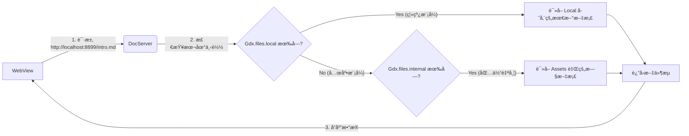

# 讨论å†å²: 


## V1

- git commit æäº¤æ ¼å¼  

| ç±»å‹ (Type) | å«ä¹‰ | å½’å±æ—¥å¿— (Target Log) | 示例 |
| :--- | :--- | :--- | :--- |
| **feat** | 新功能 | **用户日志 (User)** | `feat(editor): å¢åŠ FSMå¯è§†åŒ–编辑器` |
| **fix** | ä¿®å¤Bug | **用户日志 (User)** | `fix(input): ä¿®å¤æŸäº›æƒ…况下鼠标焦点丢失` |
| **perf** | 性能优化 | **åŒè½¨ (User & Tech)** | `perf(render): 引入FBO缓存优化渲染` |
| **refactor**| 代ç é‡æ„ | **技术日志 (Tech)** | `refactor(mvp): é‡æ„EditorController为MVPæ¶æ„` |
| **chore** | æ„建/æ‚项 | **技术日志 (Tech)** | `chore(gradle): å‡çº§LibGDX版本到1.12.1` |
| **docs** | 文档 | **技术日志 (Tech)** | `docs(readme): æ›´æ–°API手册链æ¥` |

[User] 修正: å†åŠ ä¸ªtest, 以上已确认

[User]  
- 显示格å¼åŒ–: 对äºæ交者æ¥è¯´feat: xxx这一行为标题, 然åæ¢è¡Œå…¶ä½™æ‰€æœ‰å†…容为细节
- 在游æˆå†…显示时(这里已ç»å†³å®šæ”¹ä¸ºå†…ç½®æµè§ˆå™¨ç½‘页方å¼(å®ç°ä¸ºç»Ÿä¸€æ¥å£ç„¶ååŒç«¯å®ç°å†…ç½®æµè§ˆå™¨))
- 显示项目文档大分类, 里é¢æ˜¯å¼•æ“内容总览, å¼€å‘者文档, 版本更新文档(这个å³è‡ªåŠ¨åŒ–显示的部分): 
- 我们è¦æ ¹æ®æ交时所处的版本æ¥åˆ›å»ºæ ‘: 1.10.11 1.10.12...这些是一个page, 折å å†…部, 
  - 里é¢é€†åºæ˜¾ç¤ºæ¯ä¸ªä¿®è®¢ç‰ˆæœ¬æ›´æ–°: 1.10.11.0: feat: xxx\n详细内容: xxx, docs: xx\n内容xxx

- 标记: 就是当å‰ç‰ˆæœ¬, 未æ¥ç‰ˆæœ¬, å†å²ç‰ˆæœ¬
- 用户打开内置æµè§ˆå™¨æ—¶è‡ªåŠ¨ä¸‹è½½ç„¶å离线看文档, 这时它å¯èƒ½æ˜¯æ—§ç‰ˆäº†, 也
- å¯èƒ½æˆ‘们文档写了一个还未å‘布的版本的信æ¯, äºæ˜¯ä¼šå‡ºç°æœªæ¥ç‰ˆæœ¬çš„内容, 
- 以åŠæ¯”对用户本地和这个文档版本æ¥æ ‡è®°å“ªä¸ªæ˜¯å½“å‰ç‰ˆæœ¬å†…容并自动展开, 
- 过å»å’Œæœªæ¥é»˜è®¤æ”¶èµ·, 过å»åªå±•ç¤ºå¤šä¸ªç‰ˆæœ¬å·åˆ—表收起其内容, 
- 我们先åšç‰ˆæœ¬æ—¥å¿—这一大å—, 整个文档的其他部分先åšä¸ªç©ºæ¶å­åœ¨é‚£æ”¾ç€)
---

- 当å‰`git commits æ ¼å¼æ£€æŸ¥`hook文件的自动注入任务
```
// ============================================================================
//  Git Hook 自动安装 (é…置阶段立å³æ‰§è¡Œ)
//  åŸç†ï¼šåˆ©ç”¨ Gradle é…置阶段特性，æ¯æ¬¡ Sync 或æ„建å‰ç›´æ¥å†™å…¥é’©å­æ–‡ä»¶
// ============================================================================

def installGitHooks = { ->
	def gitHooksDir = new File(rootProject.rootDir, '.git/hooks')

	// 1. 安全检查：åªæœ‰åœ¨æ˜¯ Git 仓库时æ‰æ‰§è¡Œ
	if (!gitHooksDir.exists()) return

	def hookFile = new File(gitHooksDir, 'commit-msg')

	// 2. 定义钩å­å†…容 (Shell Script)
	def rawContent =
		"""#!/bin/sh
# ------------------------------------------------------------------
# Auto-generated by GDEngine Gradle. Do not edit manually.
# ------------------------------------------------------------------

commit_msg_file=\$1
commit_msg=\$(cat "\$commit_msg_file")

# 正则表达å¼ï¼šå¿…须以指定类å‹å¼€å¤´
# å…许类å‹: feat, fix, perf, docs, refactor, chore, test
# æ ¼å¼: type: summary (注æ„冒å·å有空格)
# å¯é€‰Scope: type(scope): summary
pattern="^(feat|fix|perf|docs|refactor|chore|test)(\\\\(.+\\\\))?: .+\$"

if ! echo "\$commit_msg" | grep -qE "\$pattern"; then
    echo "⌠[COMMIT REJECTED] æ交格å¼æ ¡éªŒå¤±è´¥ï¼"
    echo "-----------------------------------------------------------------------"
    echo "æ ¼å¼è¦æ±‚: <type>: <summary>"
    echo "          (空行)"
    echo "          <details body...>"
    echo "-----------------------------------------------------------------------"
    echo "✅ feat:     新功能"
    echo "✅ fix:      ä¿®å¤Bug"
    echo "✅ perf:     性能优化"
    echo "✅ docs:     文档/资æºæ›´æ–°"
    echo "✅ refactor: 代ç é‡æ„"
    echo "✅ chore:    æ„建/ä¾èµ–/æ‚务"
    echo "✅ test:     测试用例"
    echo "-----------------------------------------------------------------------"
    echo "示例标题: feat: å¢åŠ Webæµè§ˆå™¨ç»„件"
    echo "-----------------------------------------------------------------------"
    exit 1
fi
"""
	try {
		// 强制转æ¢ä¸º Unix æ¢è¡Œç¬¦ (\n)，防止 Windows \r\n 导致 Shell 脚本报错
		String unixContent = rawContent.replaceAll("\\r\\n?", "\n")

		// 3. ç›´æ¥å†™å…¥ UTF-8 字节
		hookFile.setBytes(unixContent.getBytes("UTF-8"))

		hookFile.setExecutable(true)
		println "✅ Git Commit Hook (commit-msg) 已更新 (规则: feat/fix/perf/docs/refactor/chore/test)。"
	} catch (Exception ignored) {
		// 忽略异常，防止éGitç¯å¢ƒæŠ¥é”™
	}
}

// ç«‹å³è°ƒç”¨
installGitHooks()
```
[User] 打开内置æµè§ˆå™¨æ—¶è·³è½¬äº‘端文档, 并æ供下载按钮å¯ä»¥ä¸‹è½½åˆ°æœ¬åœ°ä¹‹åå¯ä»¥æŸ¥çœ‹æœ¬åœ°æ–‡æ¡£(å…¶å®å°±æ˜¯æµè§ˆå™¨cookie, ä¸è¿‡å¯¹äºå†…ç½®æµè§ˆå™¨å®ƒçš„cookieå½¢å¼æˆ‘ä¸å¤ªæ¸…楚以åŠè¿™ç§æƒ…况是å¦èƒ½ç”¨)

- 文档托管: 
  - 项目根目录下的docs/engine_docs/作为文档æº, 内部是一整个md目录树, 自动化任务æ¥å°†æ­¤mdæ ‘å˜ä¸ºhtmlå½¢å¼
  - 托管方案:
    使用 Docsify (æ度æ¨è，无需编译，纯é™æ€ JS 渲染 MD)。
    åªéœ€ä¸€ä¸ª index.html å³å¯æŠŠ /engine_docs 下的所有 Markdown å˜æˆä¸€ä¸ªæ¼‚亮的文档网站。
    在 GitHub ä»“åº“è®¾ç½®ä¸­å¼€å¯ Pages，æºé€‰æ‹© /engine_docs。
[User] 这里ä¸ç¡®å®š, 因为github-pages国内访问é常慢, 所以å¯èƒ½è¦è€ƒè™‘其他网页托管平å°æœ€å¥½å›½å†…çš„, 总之è¦ä¿è¯è®¿é—®é€Ÿåº¦å¿«

- 修改 Gradle:
[User] 修改 engine-tasks.gradle，将 copyChangeLogToAssets 任务å–消, 我们ä¸å†éœ€è¦åŒ…体assets/内置文档了, (延伸: 甚至以å模æ¿ä¹Ÿå¯èƒ½æŒ‚载到网页上æ¥åœ¨çº¿ä¸‹è½½è€Œä¸æ˜¯å†…置到包体assets/里)

一〠整体工作æµè®¾è®¡ (The Workflow)
我们的目标是：您åªç®¡æŒ‰è§„范写 Commit，剩下的（检查ã€ç”Ÿæˆæ—¥å¿—ã€å‘布）全由工具自动完æˆã€‚
1. å¼€å‘阶段 (Input)
   您在 IDE 中修改代ç ã€‚
   执行 Git Commit。
   Git Hook 介入：本地脚本自动检查 Commit æ ¼å¼ã€‚
   ⌠格å¼ä¸å¯¹ï¼ˆæ¯”如没写å‰ç¼€ï¼‰ï¼šæ‹’ç»æ交，æ示正确格å¼ã€‚
   ✅ æ ¼å¼æ­£ç¡®ï¼šå…许æ交。
[User] 上é¢è¿™ä¸ªæ£€æŸ¥æˆ‘支æŒ, 已确定

2. æ„建/å‘布阶段 (Processing)
   您准备å‘布新版本时，è¿è¡Œä¸€ä¸ª Gradle 任务（例如 gradle generateChangelog）。
   脚本逻辑：
   抓å–上个版本标签（Tag）到当å‰çš„所有 Commit。
   自动分æµï¼šæ ¹æ® Commit å‰ç¼€ï¼Œå°†æ—¥å¿—分å‘到 changelog_user.json（给用户看）和 changelog_tech.md（给自己看）。
   将生æˆçš„日志文件ä¿å­˜åˆ° /docs 目录（用äºä¸Šä¼  GitHub）和 /assets 目录（作为本地兜底）。
[User]   
- 这里ä¸å¯¹, 我想的是å¯ä»¥åœ¨å‘布时写å‘布版本å·ä¸å‘布信æ¯, 
- 然å自动更新gradle.properties版本å·
  - (这会触å‘BuildConfigå’ŒReadMe替æ¢æ›´æ–°ä»»åŠ¡, 
  - ä¸è¿‡ä¹‹åå¯èƒ½ç›´æ¥é›†æˆåˆ°å‘布任务中而ä¸æ˜¯æ‰‹åŠ¨æ”¹gradle.properties然å刷新æ¥è§¦å‘)
- 然å抓å–所有上个版本å·åˆ°è¿™ä¸ªç‰ˆæœ¬å·ä¹‹é—´æ‰€æœ‰Commitæ¥ç”Ÿæˆæ€»å‘布信æ¯
  - 包括手动写的总结内容也就是å‘布信æ¯(给用户看), 
  - 和抓å–的所有commitä¿¡æ¯çš„æ ¼å¼åŒ–版本(å¯èƒ½è¦å°†å…¶æ ¼å¼åŒ–为标准文档版本, 或者ä¸æ ¼å¼åŒ–因为本æ¥æ¯”较标准直æ¥å½•å…¥?)
- 最主è¦æ˜¯æˆ‘们è¦ä¿å­˜åˆ°docs/engine_docs/下(或者还有个归类目录?还是ä¸, 应该还有个å­ç›®å½•ç”¨äºå½’ç±»change_logs/这样)
  - 然å这整个engine_docs/下会有
      1. 引æ“总览
      2. 用户手册
      3. å¼€å‘者文档
      4. 引æ“å˜æ›´æ—¥å¿—
- 然å通过那个Docsify什么的(这个我ä¸å¤ªäº†è§£å•Šæ€»ä¹‹æ˜¯ä¸€ä¸ªmd转html站的工具?)
- æ¥å°†engine_docs/下的所有md文件转æ¢ä¸ºhtml文件
- 并托管到一个网站上(当然具体是什么还ä¸ç¡®å®š, 看哪个快用哪个)

行动路径建议：
定义 IWebBrowser æ¥å£ï¼šè¿™æ˜¯æ ¸å¿ƒï¼Œå…ˆåœ¨ Core 层把æ¥å£å®šæ­»ã€‚
å®ç° Android 端 WebView：这是移动端的å®ç°ã€‚
å®ç° Desktop 端 WebView：这是 PC 端的å®ç°ï¼ˆè¿™æ˜¯éš¾ç‚¹ï¼ŒLwjgl3 没有åŸç”Ÿ WebView，å¯èƒ½éœ€è¦å¼•å…¥æ‰©å±•åº“）。
编写 Gradle è„šæœ¬ç”Ÿæˆ JSON：解æ Git Log 并生æˆä¸Šè¿° JSON 文件。
编写 HTML 模æ¿ï¼šåˆ¶ä½œä¸€ä¸ªå¥½çœ‹çš„ HTML/JS 页é¢ï¼Œç”¨äºåœ¨ WebView 里通过 JS æ¥æ”¶ JSON 并渲染æˆæ ‘。

[User]   
- web端需求是确定的, 就是上é¢é‚£æ ·, 
- 一套æ¥å£, 然åå¹³å°åˆ†åˆ«å®ç°æµè§ˆå™¨, 
- 但是ä¸è¦json, 我们已ç»å†³å®šç”¨Docsifyçš„md转html了, 
- 如æœé¡ºåˆ©, 我们就å¯ä»¥ç›´æ¥ç”¨Docsifyçš„html页é¢æ¥å±•ç¤ºæ•´ä¸ªæ–‡æ¡£äº†
- (ä¸è¿‡è¿™é‡Œæˆ‘åˆæƒ³åˆ°ä¸€ä¸ªä¸œè¥¿, 
- 就是咱们是先大版本分类还是说先内容上分类, 
- 比如进å»å…ˆçœ‹åˆ°1.10.11...\n1.10.10...
- 还是先看到用户手册/å¼€å‘者文档/引æ“å˜æ›´æ—¥å¿—, 
- 哦我懂了,
  - 引æ“总览是顶级的
  - 然å是版本文档
    - 然å分版本(默认展示最新版本文档): 1.10.11...1.10.10, 并å¯ä»¥ä¸‹æ‹‰é€‰æ‹©åˆ°å¯¹åº”版本查看
    - 然å是æ¯ä¸ªç‰ˆæœ¬çš„用户手册/å¼€å‘者文档/引æ“å˜æ›´æ—¥å¿—
- ä¸å¯¹ä¸å¯¹, æ€ä¹ˆæ¯ä¸ªç‰ˆæœ¬éƒ½å®Œå…¨å†™ä¸€æ¬¡
- 应该,,,åªæœ‰å¤§ç‰ˆæœ¬ä¼šåŒºåˆ†: 比如1.11就是一个å¯èƒ½å®Œå…¨ä¸å…¼å®¹1.10的大版本所以是两个界é¢
- ä¸è¿‡ç°åœ¨å’±ä»¬å¯èƒ½éƒ½è€ƒè™‘ä¸åˆ°é‚£é‡Œ, 咱们ç°åœ¨å…ˆä¸åšç‰ˆæœ¬åŒºåˆ†, 就是一套顶级的用户手册/å¼€å‘者文档/引æ“å˜æ›´æ—¥å¿—, (写上1.10.11æ¥è¯´æ˜æˆªè‡³æœ€æ–°ç‰ˆæœ¬å°±è¡Œ)
- )


## V2
好的，我们放慢节å¥ï¼Œå…ˆè¿›è¡Œ**深度设计讨论**。您æ到的“文档结æ„设计â€ç¡®å®æ˜¯é‡ä¸­ä¹‹é‡ï¼Œå®ƒå†³å®šäº†å续的自动化逻辑如何编写，以åŠç”¨æˆ·ä½“验是å¦é¡ºç•…。

针对您æ出的三个修正点，我é€ä¸€è§£ç­”并展开设计。

---

### 一〠什么是 CI/CD æ„建？ (解答)

**CI/CD (æŒç»­é›†æˆ/æŒç»­äº¤ä»˜)** 在我们这个项目的语境下，指的是**“ä¸éœ€è¦æ‚¨æ‰‹åŠ¨æ“作的自动化æµæ°´çº¿â€**。

*   **ç°çŠ¶**：目å‰æ‚¨å‘布版本å¯èƒ½éœ€è¦ï¼šæ‰‹åŠ¨æ”¹ `BuildConfig` ç‰ˆæœ¬å· -> 手动è¿è¡Œ Gradle 打包 -> 手动写更新日志 -> 手动上传文件。
*   **CI/CD 的愿景**：
	1.  您在本地写好代ç ï¼Œæ交 Git Tag (例如 `v1.10.11`)，æ¨é€åˆ° GitHub/Gitee。
	2.  **CI (æ„建)**：云端æœåŠ¡å™¨ï¼ˆå¦‚ GitHub Actions）自动检测到新 Tag，自动è¿è¡Œ Gradle 编译，跑通所有测试。
	3.  **CD (交付)**：
		*   自动抓å–两次 Tag 之间的所有 Commit。
		*   è‡ªåŠ¨ç”Ÿæˆ `changelog.json` å’Œ HTML 文档。
		*   自动把 APK/JAR 和文档å‘布到下载æœåŠ¡å™¨ã€‚
	4.  **结æœ**ï¼šç”¨æˆ·æ‰“å¼€æ¸¸æˆ Hub，立刻看到新版本æ示和新日志，而您除了“æ¨é€ä»£ç â€å¤–，ä¸éœ€è¦åšä»»ä½•ç¹çæ“作。

---
[User] 这个挺好的, 但是ç°åœ¨è¿˜æ²¡è€ƒè™‘到那么全的事情, å…ˆä¸ç®¡

### äºŒã€ å…³äº WebView (确认方案)

既然需求已确定，技术路线é”定为：
*   **核心能力**：`IWebBrowser` æ¥å£ã€‚
*   **本地æµè§ˆæ–¹æ¡ˆ**：**LocalHost ç­–ç•¥**。
	*   游æˆå¯åŠ¨æ—¶ï¼Œå†…ç½®ä¸€ä¸ªå¾®å‹ HTTP æœåŠ¡å™¨ (如 `NanoHTTPD`，é常轻é‡)。
	*   它将 `assets/docs/` 目录映射为 `http://localhost:port/`。
	*   **优势**：完ç¾è§£å†³ WebView 加载本地文件时的跨域 (CORS) 问题，åŒæ—¶æ”¯æŒå›¾ç‰‡ã€CSS 引用，且代ç é€»è¾‘ä¸åœ¨çº¿æµè§ˆå®Œå…¨ä¸€è‡´ï¼ˆéƒ½æ˜¯ HTTP 请求）。

---
[User] 
- ä¸æ˜¯assets/docs/, å·²ç»ç¡®å®šä¸åœ¨åŒ…体内嵌文档了, 
- 文档æºåœ¨docs/engine_docs/下, 通过Docsify自动转html, CI/CD自动托管云端网页, 
- æµè§ˆæºåœ¨äº‘端离线æµè§ˆä¿å­˜åœ¨cookie, 
  - 但是cookie方案ä¸å¯ç”¨çš„è¯å°±ä¿å­˜åˆ°Gdx.files.local("engine_docs"), 然å通过文件方å¼åŠ è½½ç½‘页

### 三〠文档结æ„设计标准 (核心é‡å¤´æˆ)

我们è¦æ¨¡ä»¿æˆç†Ÿå¼•æ“（如 Unity/Godot）的结æ„，åŒæ—¶ç»“åˆ GDEngine 的特色。以下是我为您设计的**文档æ¶æ„è“图**。

这个结æ„将直æ¥å¯¹åº”您的 **侧边æ å¯¼èˆªæ ‘** å’Œ **文件存储目录**。

#### 1. 顶层导航æ¶æ„ (The Root)

我们把文档分为四大æ¿å—（对应侧边æ çš„一级èœå•ï¼‰ï¼š

1.  **🠠引æ“概览 (General)**
	*   *ç»™åˆå­¦è€…看，介ç»å¼•æ“是什么，æ€ä¹ˆå®‰è£…。*
2.  **📘 å¼€å‘者手册 (Manual)**
	*   *核心部分，按功能模å—分类，教用户æ€ä¹ˆç”¨å¼•æ“。*
3.  **âš™ï¸ API å‚考 (Scripting API)**
	*   *查字典用，类ã€æ–¹æ³•ã€å‚数说æ˜ã€‚*
4.  **📅 版本日志 (Changelog / Release Notes)**
	*   *按时间倒åºæ’列的更新记录（自动化生æˆçš„é‡ç‚¹ï¼‰ã€‚*

[User] 嗯说的挺好的, 虽然没有涉åŠåˆ°ç‰ˆæœ¬çš„区分, 但是已ç»å¾ˆå®Œå–„了这个设计

#### 2. 详细目录树设计

```text
Docs/
├── index.html (å…¥å£)
├── general/
│   ├── introduction.md      (简介)
│   ├── installation.md      (安装ä¸ç¯å¢ƒé…ç½®: JDK/Android SDK)
│   └── editor_overview.md   (编辑器界é¢é€Ÿè§ˆ)
├── manual/
│   ├── core/                (核心概念)
│   │   ├── ecs_workflow.md  (ECS工作æµ: World/Entity/Component)
│   │   └── lifecycle.md     (生命周期: Awake/Start/Update)
│   ├── scripting/           (脚本开å‘)
│   │   ├── creating_scripts.md
│   │   └── event_system.md
│   ├── graphics/            (图形渲染)
│   │   ├── sprites.md
│   │   └── neon_skeleton.md (骨骼动画系统)
│   └── physics/             (物ç†ä¸æ•°å­¦)
│       └── transform.md
└── changelog/               (由程åºè‡ªåŠ¨ç”Ÿæˆ)
    ├── changelog.json       (核心数æ®æº)
    └── index.html           (渲染器)
```

[User]  
- 目录树这å—我ä¸æ¸…楚, 
- 但肯定的是肯定ä¸ä¼šåœ¨åŒ…体内存这个东西, 
- 如æœä»–说的是æºçš„è¯, 那我们确å®è¦åœ¨é¡¹ç›®é‡Œå†™è¿™ä¸ªæºè¿™å€’是确定的 


#### 3. 版本日志的“时空折å â€è®¾è®¡ (é‡ç‚¹è®¨è®º)

您æ到的“未æ¥/当å‰/å†å²â€ä»¥åŠâ€œè‡ªåŠ¨å±•å¼€â€é€»è¾‘，需è¦ä¾èµ– **JSON æ•°æ®ç»“æ„** å’Œ **客户端逻辑** é…åˆã€‚

**场景模拟：**
*   **用户本地引æ“版本**：`1.10.11`
*   **云端文档版本**：`1.10.13` (您已ç»å†™äº†æ–°åŠŸèƒ½ä½†åœ¨å†…测，还没å‘给用户)

**ç•Œé¢æ˜¾ç¤ºé€»è¾‘：**

1.  **🚀 未æ¥ç‰ˆæœ¬ (Future)** - *默认折å *
	*   **1.10.13** `[New]`
	*   **1.10.12** `[New]`
	*   *(æ示用户：您的版本过旧，这些是预览内容)*
2.  **✅ 当å‰ç‰ˆæœ¬ (Current)** - ***自动展开***
	*   **1.10.11** `[Installed]`
		*   **1.10.11.2** (Patch)
			*   `fix: ä¿®å¤è¾“入法焦点`
		*   **1.10.11.0** (Release)
			*   `feat: å¢åŠ WebView`
				*   *详细内容：集æˆäº†Chromium...*
3.  **📜 å†å²ç‰ˆæœ¬ (History)** - *默认折å *
	*   **1.10.10**
	*   **1.9.x**

#### 4. 自动化 JSON æ•°æ®ç»“æ„定义

为了支撑上é¢çš„显示逻辑，Git Commit 转æ¢æˆçš„ `changelog.json` 必须包å«ä»¥ä¸‹å­—段：

```json
{
  "latestVersion": "1.10.13",
  "lastUpdated": "2026-01-16",
  "groups": [
    {
      "version": "1.10.12",
      "date": "2026-02-01", 
      "tag": "v1.10.12",
      "commits": [
        {
          "hash": "a1b2c3d",
          "author": "GoldSprite",
          "type": "feat",
          "scope": "editor",
          "summary": "å¢åŠ å†…ç½®æµè§ˆå™¨æ”¯æŒ", 
          "details": "1. 定义IWebBrowseræ¥å£...\n2. Android端å®ç°..." 
        },
        {
          "type": "fix",
          "summary": "ä¿®å¤Inspector刷新闪çƒ",
          "details": ""
        }
      ]
    },
    {
      "version": "1.10.11",
      "date": "2026-01-15",
      "commits": [...]
    }
  ]
}
```

### 四〠æµç¨‹æ€»ç»“ä¸ç¡®è®¤

**我们将按照以下顺åºæ‰§è¡Œï¼š**

1.  **Gradle 脚本å‡çº§**：编写 Groovy è„šæœ¬ï¼Œè¯»å– Git Log，正则解æ `feat: xxx`，生æˆä¸Šè¿°çš„ `changelog.json`。
2.  **Web 页é¢å¼€å‘**：编写一个纯é™æ€çš„ `changelog.html`，内嵌 JavaScript。
	*   å®ƒè´Ÿè´£è¯»å– `changelog.json`。
	*   它负责调用 Java 注入的 `getEngineVersion()` è·å–本地版本。
	*   它负责执行比对逻辑（未æ¥/当å‰/å†å²ï¼‰å¹¶æ¸²æŸ“ HTML DOM 树。
3.  **引æ“端集æˆ**：å®ç° WebView å’Œ LocalServer，加载这个 HTML。

**您ç°åœ¨éœ€è¦ç¡®è®¤çš„点：**
1.  对äºæ–‡æ¡£ç›®å½•ç»“æ„（General, Manual, API, Changelog），是å¦è¿˜éœ€è¦å¢åŠ å…¶ä»–一级分类？
2.  å¯¹äº Commit æ ¼å¼ `type: summary \n\n details`，是å¦åŒæ„å°† `summary` 作为列表标题，`details` 作为折å å±•å¼€å的详细内容？

如æœç¡®è®¤æ— è¯¯ï¼Œæˆ‘们å¯ä»¥å¼€å§‹ç€æ‰‹ç¼–写 **ç”Ÿæˆ Changelog JSON çš„ Gradle 脚本**。这将是自动化的第一步。

[User]
- 以上, 先把确定了的部分é‡æ–°å†™ç­–划案å§, 未确定的部分以åŠæŠ€æœ¯ä¸Šä¸æ¸…楚的部分å†ç»§ç»­è®¨è®º


## V3
è€å¸ˆï¼Œæ”¶åˆ°æ‚¨çš„详细批阅。您的æ€è·¯é常清晰：**核心在äºå°†æ–‡æ¡£è§†ä¸ºä¸€ä¸ªç‹¬ç«‹å‘布的WebæœåŠ¡ï¼Œè€Œé简å•çš„文本文件，引æ“åªè´Ÿè´£â€œè¿æ¥â€è¿™ä¸ªæœåŠ¡ï¼ˆåœ¨çº¿æˆ–本地镜åƒï¼‰ã€‚**

æ ¹æ®æ‚¨çš„å馈（已确定的 Git 规范ã€æ˜ç¡®çš„ Docsify 路线ã€æœ¬åœ°å­˜å‚¨æ–¹æ¡ˆã€ä»¥åŠæ—¶ç©ºæŠ˜å çš„版本展示逻辑），我é‡æ–°æ•´ç†äº†è¿™ä»½ **《GDEngine 文档ä¸è‡ªåŠ¨åŒ–日志系统策划案 (v2.0)》**。

这份文档将作为åç»­å¼€å‘çš„**唯一执行标准**。

---

# GDEngine 文档ä¸è‡ªåŠ¨åŒ–日志系统策划案 (v3.0)

## 1. 版本æ§åˆ¶è§„范 (已确定)

### 1.1 Git Commit åè®®
强制执行标准化的æ交格å¼ï¼Œæ—¢ä¸ºäº†ä»£ç å¯è¯»æ€§ï¼Œä¹Ÿä¸ºäº†è‡ªåŠ¨åŒ–脚本能精准抓å–æ•°æ®ã€‚

**æ ¼å¼æ ‡å‡†ï¼š**
```text
<ç±»å‹>: <简短标题 (Summary)>
(空行)
<详细æè¿° (Details) - 支æŒå¤šè¡Œ/Markdown列表>
```

**ç±»å‹æ˜ å°„表：**
| ç±»å‹ | å«ä¹‰ | å½’å±æ–‡æ¡£æ¿å— |
| :--- | :--- | :--- |
| **feat** | 新功能 | ✨ æ–°å¢åŠŸèƒ½ |
| **fix** | ä¿®å¤ | 🛠Bugä¿®å¤ |
| **perf** | 性能 | ⚡ 性能优化 |
| **docs** | 文档/èµ„æº | 📠文档ä¸èµ„æº |
| **refactor**| 代ç é‡æ„ | â™»ï¸ ä»£ç é‡æ„ (通常折å ) |
| **chore** | æ„建/æ‚务 | 🔧 æ„建ä¸æ‚务 (通常折å ) |
| **test** | 测试 | ✅ 测试 (通常ä¸æ˜¾ç¤º) |

### 1.2 è‡ªåŠ¨åŒ–çº¦æŸ (Git Hook)
*   **动作**：更新 `engine-tasks.gradle`。
*   **逻辑**：在 Gradle é…置阶段自动写入 `.git/hooks/commit-msg`。
*   **校验**：æ交时若ä¸ç¬¦åˆæ­£åˆ™ `^(feat|fix|perf|docs|refactor|chore|test)(\(.+\))?: .+$`，直æ¥æ‹’ç»æ交并æ示标准格å¼ã€‚

---

## 2. 文档工程结æ„设计 (核心é‡å¤´æˆ)

文档ä¸å†ä½œä¸º `assets` 资æºï¼Œè€Œæ˜¯ä½œä¸ºä¸€ä¸ª**独立的é™æ€ç½‘站项目**存在äºæºç æ ‘中。

### 2.1 目录æ¶æ„ (`docs/engine_docs/`)
这是 Docsify 的根目录，å续将被转化为 HTML 站点。

```text
GDEngine/
├── docs/
│   └── engine_docs/          <-- 文档æºæ ¹ç›®å½• (GitHub Pages 指å‘这里)
│       ├── index.html        <-- Docsify å…¥å£ (包å«JSé…ç½®)
│       ├── _sidebar.md       <-- 侧边æ å¯¼èˆªé…ç½®
│       ├── _navbar.md        <-- 顶部导航é…ç½®
│       ├── coverpage.md      <-- å°é¢é¡µ (大Logo)
│       │
│       ├── changelog/        <-- [自动化生æˆåŒº]
│       │   ├── changelog.json  <-- 核心数æ®ï¼šåŒ…å«æ‰€æœ‰ç‰ˆæœ¬çš„结æ„化日志
│       │   └── README.md       <-- 包å«ä¸€æ®µJS脚本，用äºè¯»å–JSON并渲染"时空折å "UI
│       │
│       ├── general/          <-- [1. 引æ“总览]
│       │   ├── intro.md
│       │   └── setup.md
│       ├── manual/           <-- [2. å¼€å‘者手册]
│       │   ├── ecs.md
│       │   └── scripting.md
│       └── api/              <-- [3. API å‚考]
│           └── index.md
└── ...
```

### 2.2 自动化数æ®æµ
1.  **Gradle 任务 (`generateChangelog`)**:
	*   è¯»å– Git Tags (如 `v1.10.11`, `v1.10.12`)。
	*   è·å– Tag 之间的 Commits。
	*   解æ Commit Message çš„ `Header` (标题) å’Œ `Body` (细节)。
	*   生æˆ/æ›´æ–° `docs/engine_docs/changelog/changelog.json`。

### 2.3 JSON æ•°æ®ç»“æ„标准
为了支æŒæ‚¨çš„“未æ¥/当å‰/å†å²â€åˆ¤æ–­ï¼ŒJSON 必须包å«ç‰ˆæœ¬å·å’Œæ—¥æœŸã€‚

```json
{
  "latestVersion": "1.10.13",
  "updateTime": "2026-01-16",
  "versions": [
    {
      "id": "1.10.12",
      "date": "2026-02-01",
      "tag": "v1.10.12",
      "changes": [
        {
          "type": "feat",
          "title": "å¢åŠ Webæµè§ˆå™¨ç»„件",
          "details": "1. 定义IWebBrowseræ¥å£...\n2. Android端å®ç°..."
        }
      ]
    },
    {
      "id": "1.10.11", 
      "date": "2026-01-15",
      "tag": "v1.10.11",
      "changes": [...]
    }
  ]
}
```

---

## 3. è¿è¡Œæ—¶é›†æˆæ–¹æ¡ˆ (Web Browser)

游æˆå†…ä¸ç›´æ¥è§£æ Markdown，而是内嵌一个æµè§ˆå™¨çª—å£ï¼ŒåŠ è½½ä¸Šè¿° Docsify 站点。

### 3.1 核心æ¥å£ (`core`)
```java
public interface IWebBrowser {
    /** 
     * 打开æµè§ˆå™¨ 
     * @param url 目标地å€
     * @param localVersion 传入当å‰å¼•æ“ç‰ˆæœ¬å· (用äºé¡µé¢é«˜äº®"当å‰ç‰ˆæœ¬")
     */
    void openDocs(String url, String localVersion);
}
```

### 3.2 åŒç«¯å®ç°ç­–ç•¥
*   **Android**: 使用åŸç”Ÿ `WebView` (XML布局或动æ€æ·»åŠ )。
*   **Desktop (Lwjgl3)**:
	*   *方案A (简å•)*: 调用 `Gdx.net.openURI()` 唤起系统默认æµè§ˆå™¨ï¼ˆChrome/Edge）。
	*   *方案B (内嵌)*: é›†æˆ `JCEF` (Chromium Embedded Framework) 或 `JavaFX WebView`。*(注：考虑到维护æˆæœ¬ï¼Œå»ºè®®åˆæœŸä½¿ç”¨æ–¹æ¡ˆA，å期考虑方案B)*。

### 3.3 离线/在线 æ··åˆåŠ è½½é€»è¾‘ (Load Strategy)

这是满足您“下载离线看â€éœ€æ±‚的关键æµç¨‹ï¼š

1.  **检查云端è¿æ¥**: å°è¯• `HEAD` 请求访问云端 `index.html`。
2.  **æˆåŠŸ (Online)**:
	*   ç›´æ¥åŠ è½½ `https://your-site.com/engine_docs/index.html?v=1.10.11`。
	*   URL å‚æ•° `v=...` 告诉网页哪个是当å‰ç‰ˆæœ¬ã€‚
	*   *åå°é™é»˜ä¸‹è½½*: 将整个 `engine_docs` 站点资æºä¸‹è½½åˆ° `Gdx.files.local("engine_docs")` 更新本地缓存。
3.  **失败 (Offline)**:
	*   检查本地 `Gdx.files.local("engine_docs/index.html")` 是å¦å­˜åœ¨ã€‚
	*   **å¯åŠ¨å¾®å‹æœåŠ¡å™¨**: å¯åŠ¨ `NanoHTTPD` 绑定éšæœºç«¯å£ (如 8899)，根目录指å‘本地文件夹。
	*   加载 `http://localhost:8899/index.html?v=1.10.11`。

---

## 4. "时空折å " UI 逻辑 (å‰ç«¯å®ç°)

这部分逻辑写在 `docs/engine_docs/changelog/README.md` 中嵌入的 `<script>` 里。Docsify 渲染该页é¢æ—¶ä¼šæ‰§è¡Œ JS。

**渲染逻辑 (伪代ç ):**

1.  **è·å–å‚æ•°**:
	*   `clientVer` = URLå‚æ•°ä¸­çš„ç‰ˆæœ¬å· (例如 "1.10.11")。
	*   `data` = è¯»å– `changelog.json`。

2.  **éå† `data.versions`**:
	*   **If `ver.id` > `clientVer`**:
		*   标记为 **[未æ¥ç‰ˆæœ¬] (Future)**。
		*   æ ·å¼ï¼šåŠé€æ˜ï¼Œæ ‡é¢˜å³ä¾§åŠ  `🚀 Preview` 标签。
		*   状æ€ï¼š`Collapsed` (折å )。
	*   **If `ver.id` == `clientVer`**:
		*   标记为 **[当å‰ç‰ˆæœ¬] (Current)**。
		*   æ ·å¼ï¼šé«˜äº®è¾¹æ¡†ï¼Œæ ‡é¢˜å³ä¾§åŠ  `✅ Installed` 标签。
		*   状æ€ï¼š`Expanded` (自动展开)，并滚动到视é‡ä¸­å¿ƒã€‚
	*   **If `ver.id` < `clientVer`**:
		*   标记为 **[å†å²ç‰ˆæœ¬] (History)**。
		*   æ ·å¼ï¼šç°è‰²æ–‡æœ¬ã€‚
		*   状æ€ï¼š`Collapsed` (折å )。

---

## 5. 待讨论ä¸ç¡®è®¤çš„技术盲点

在开始执行å‰ï¼Œæˆ‘们需è¦æœ€å确认以下几个技术细节：

1.  **Docsify 的熟悉度**: 您是å¦éœ€è¦æˆ‘æä¾› Docsify 的基础é…置模æ¿ï¼ˆindex.html, _sidebar.md）？
2.  **NanoHTTPD 引入**: 为了å®ç° Android/Desktop 通用的离线æµè§ˆï¼Œæˆ‘们需è¦å¼•å…¥ `org.nanohttpd:nanohttpd` 库 (很å°ï¼Œçº¦ 50KB)。您是å¦åŒæ„引入此ä¾èµ–？
3.  **Gradle ç”Ÿæˆ JSON**: ç›®å‰æˆ‘ä»¬æ²¡æœ‰åŸºäº Git Log ç”Ÿæˆ JSON 的脚本。这需è¦ç¼–写一段 Groovy 代ç è°ƒç”¨ `git log` 命令并解æ输出。这是**第一步**è¦è§£å†³çš„难点。

**如æœç­–划案无误，请指示下一步行动：**
*   **选项 A**: 先更新 `engine-tasks.gradle` 中的 Git Hook，确ä¿ä»ç°åœ¨å¼€å§‹çš„ Commit 都是规范的。
*   **选项 B**: å…ˆæ­å»º `docs/engine_docs` 的目录结æ„å’Œ Docsify 基础文件，让我看看效æœã€‚
*   **选项 C**: 先编写 Gradle 脚本，å°è¯•ä» Git Log ç”Ÿæˆ `changelog.json` (å³ä½¿ç°åœ¨æ•°æ®ä¸å¤š)。


## V3-Fix
- 我们边åšè¾¹ä¿®æ­£å§
  - 首先完æˆåŸºæœ¬ç¡®å®šéœ€æ±‚的内置Web, 
  - ä¸è¿‡è¿™ä¸ªè¿˜æœ‰ä¸ªä¸ç¡®å®šçš„, 
    - 就是我说的离线问题, 
    - 咱们是直æ¥cookie还是localStorage?, 
    - è¿™å–决äºå®ç°çš„内置WebView有多少功能,能å¦è¿˜åŸå®Œæ•´çš„æµè§ˆå™¨åŠŸèƒ½, 包括cookie, 
  - 如æœä¸è¡Œ, 咱们就åªèƒ½åšå­˜å‚¨åˆ°Gdx.files.localä½ç½®, 然åç”¨å¾®å‹ HTTP æœåŠ¡å™¨æ¥è§£å†³è·¨åŸŸæµè§ˆäº†

### 执行1
è€å¸ˆï¼Œæ‚¨çš„决策é常务å®ã€‚**“边åšè¾¹ä¿®æ­£â€** 是软件工程中é¿å…过度设计的最佳策略。

å…³äºæ‚¨æ出的**离线存储**核心疑点，我的技术判断如下：

### 核心决策：放弃 Cookie/LocalStorage，采用“文件系统 + å¾®å‹æœåŠ¡å™¨â€

**结论：** 我们必须采用 **`Gdx.files.local` 存储文件 + `NanoHTTPD` 本地æœåŠ¡å™¨** 的方案。

**ç†ç”± (Why):**
1.  **域隔离 (Domain Isolation)**: æµè§ˆå™¨çš„ `localStorage` 是基äºåŸŸå的。`https://gitee.com/docs` å’Œ `file:///android_asset/docs` 是两个完全隔离的世界，数æ®æ— æ³•äº’通。如æœä¸å¯æœåŠ¡å™¨ï¼Œæ‚¨åœ¨æœ¬åœ°æ— æ³•è¯»å–云端写入的状æ€ã€‚
2.  **容é‡é™åˆ¶**: LocalStorage 通常é™åˆ¶ 5MB，Cookie ä»… 4KB。存ä¸ä¸‹æ•´ä¸ªå¼•æ“文档（包å«å›¾ç‰‡ï¼‰ã€‚
3.  **CORS (跨域)**: ç›´æ¥ç”¨ WebView 打开本地 HTML 文件 (`file://`) 请求外部 JSON 或本地其他目录资æºæ—¶ï¼Œç°ä»£ WebView 会有é常严格的安全é™åˆ¶ï¼Œå¯¼è‡´åŠ è½½å¤±è´¥ã€‚
4.  **æ§åˆ¶æƒ**: 使用 Java 层 (`Gdx.net`) 下载文档包到本地ç£ç›˜ï¼Œæ¯”ä¾èµ– WebView 内部的缓存机制è¦å¯é å¾—多，且完全å¯æ§ï¼ˆè¿›åº¦æ¡ã€æ–­ç‚¹ç»­ä¼ ã€ç‰ˆæœ¬æ ¡éªŒï¼‰ã€‚

---

### 第一阶段行动：æ„建æµè§ˆå™¨åŸºç¡€æ¶æ„

我们ç°åœ¨ä¸è°ˆå¤æ‚çš„ JSON 生æˆå’ŒæœåŠ¡å™¨ï¼Œ**先迈出第一步：让引æ“拥有“打开网页â€çš„能力。**

我们将在 `core` 层定义æ¥å£ï¼Œå¹¶åˆ†åˆ«åœ¨ Android (内嵌WebView) å’Œ Desktop (调用系统æµè§ˆå™¨) å®ç°å®ƒã€‚

*(注：Desktop 端集æˆå†…嵌 CEF/Chromium æ为沉é‡ä¸”å¤æ‚，通常 99% çš„ LibGDX æ¡Œé¢åº”用都选择调用系统默认æµè§ˆå™¨ï¼Œä½“验更æµç•…且ä¸å¢åŠ åŒ…体积。我们先按此å®ç°ï¼Œå续有强需求å†æ”¹)*

#### 1. 定义核心æ¥å£

请在 `core` 模å—创建新包 `com.goldsprite.magicdungeon.core.web`。

**文件 1: `core/src/main/java/com/goldsprite/gdengine/core/web/IWebBrowser.java`**

```java
package com.goldsprite.magicdungeon.core.web;

/**
 * è·¨å¹³å° Web æµè§ˆå™¨æ¥å£
 * <p>
 * èŒè´£ï¼šç»Ÿä¸€ä¸åŒå¹³å°çš„网页æµè§ˆè¡Œä¸ºã€‚
 * </p>
 */
public interface IWebBrowser {
    /**
     * 打开指定 URL
     * @param url ç›®æ ‡åœ°å€ (http://... 或 http://localhost:port/...)
     * @param title 窗å£æ ‡é¢˜ (ä»… Android/内嵌模å¼æœ‰æ•ˆ)
     */
    void openUrl(String url, String title);

    /**
     * 关闭æµè§ˆå™¨ (仅内嵌模å¼æœ‰æ•ˆ)
     */
    void close();
    
    /**
     * 是å¦æ”¯æŒå†…嵌æµè§ˆ
     * @return true=内嵌(Android), false=外部跳出(Desktop)
     */
    boolean isEmbedded();
}
```

**文件 2: `core/src/main/java/com/goldsprite/gdengine/core/Gd.java` (追加字段)**

我们需è¦åœ¨å…¨å±€å…¥å£ `Gd` 中å¢åŠ è¿™ä¸ªæœåŠ¡çš„引用。

```java
// ... existing code ...
public class Gd {
    // ... existing fields ...

    /** 全局æµè§ˆå™¨æœåŠ¡ */
    public static IWebBrowser browser; // [New]

    public static void init(Mode runMode, Input inputImpl, Graphics graphicsImpl, IScriptCompiler compilerImpl) {
        // ... existing code ...
        
        // 默认å®ç°ï¼šå…œåº•ä½¿ç”¨ Gdx.net.openURI (防空指针)
        if (browser == null) {
            browser = new IWebBrowser() {
                @Override public void openUrl(String url, String title) { Gdx.net.openURI(url); }
                @Override public void close() {}
                @Override public boolean isEmbedded() { return false; }
            };
        }
    }
    
    // [æ–°å¢] å…许平å°å±‚注入å®ç°
    public static void setWebBrowser(IWebBrowser browserImpl) {
        browser = browserImpl;
    }
}
```

---

#### 2. Android 端å®ç° (真正的内嵌 WebView)

在 Android 端，我们使用一个 `Dialog` 或者新的 `Activity` æ¥æ‰¿è½½ `WebView`。为了轻é‡åŒ–，这里æ¨èä½¿ç”¨å…¨å± `Dialog`。

**文件 3: `android/src/main/java/com/goldsprite/gdengine/android/AndroidWebBrowser.java`**

```java
package com.goldsprite.magicdungeon.android;

import android.app.Activity;
import android.app.Dialog;
import android.graphics.Color;
import android.view.View;
import android.view.ViewGroup;
import android.view.Window;
import android.view.WindowManager;
import android.webkit.WebChromeClient;
import android.webkit.WebSettings;
import android.webkit.WebView;
import android.webkit.WebViewClient;
import android.widget.FrameLayout;
import android.widget.ImageButton;
import android.widget.LinearLayout;
import android.widget.TextView;

import com.goldsprite.magicdungeon.core.web.IWebBrowser;

public class AndroidWebBrowser implements IWebBrowser {
    private final Activity activity;
    private Dialog webDialog;
    private WebView webView;

    public AndroidWebBrowser(Activity activity) {
        this.activity = activity;
    }

    @Override
    public void openUrl(String url, String title) {
        activity.runOnUiThread(() -> showWebDialog(url, title));
    }

    @Override
    public void close() {
        if (webDialog != null && webDialog.isShowing()) {
            webDialog.dismiss();
        }
    }

    @Override
    public boolean isEmbedded() {
        return true;
    }

    private void showWebDialog(String url, String title) {
        if (webDialog == null) {
            initDialog();
        }
        
        // 更新标题
        if (webDialog.findViewById(101) instanceof TextView) {
            ((TextView) webDialog.findViewById(101)).setText(title);
        }

        webView.loadUrl(url);
        webDialog.show();
    }

    private void initDialog() {
        webDialog = new Dialog(activity, android.R.style.Theme_Black_NoTitleBar_Fullscreen);
        webDialog.requestWindowFeature(Window.FEATURE_NO_TITLE);
        
        // 根布局
        LinearLayout root = new LinearLayout(activity);
        root.setOrientation(LinearLayout.VERTICAL);
        root.setBackgroundColor(Color.WHITE);

        // 1. é¡¶éƒ¨æ  (Toolbar)
        LinearLayout toolbar = new LinearLayout(activity);
        toolbar.setOrientation(LinearLayout.HORIZONTAL);
        toolbar.setBackgroundColor(Color.parseColor("#333333"));
        toolbar.setPadding(20, 20, 20, 20);
        
        // 关闭按钮
        TextView closeBtn = new TextView(activity);
        closeBtn.setText("⌠关闭");
        closeBtn.setTextColor(Color.WHITE);
        closeBtn.setTextSize(16);
        closeBtn.setOnClickListener(v -> close());
        
        // 标题
        TextView titleView = new TextView(activity);
        titleView.setId(101); // ID便äºæŸ¥æ‰¾
        titleView.setText("Docs");
        titleView.setTextColor(Color.CYAN);
        titleView.setTextSize(16);
        titleView.setPadding(40, 0, 0, 0);
        
        toolbar.addView(closeBtn);
        toolbar.addView(titleView);
        
        // 2. WebView
        webView = new WebView(activity);
        WebSettings settings = webView.getSettings();
        settings.setJavaScriptEnabled(true); // 必须开å¯JS
        settings.setDomStorageEnabled(true); // å¼€å¯DOM存储(å¯é€‰)
        settings.setAllowFileAccess(true);   // å…许访问文件(为离线åšå‡†å¤‡)
        
        // 设置 Client 防止跳转到系统æµè§ˆå™¨
        webView.setWebViewClient(new WebViewClient());
        webView.setWebChromeClient(new WebChromeClient());

        // 布局å‚æ•°
        LinearLayout.LayoutParams webParams = new LinearLayout.LayoutParams(
            ViewGroup.LayoutParams.MATCH_PARENT, 
            ViewGroup.LayoutParams.MATCH_PARENT
        );
        
        root.addView(toolbar);
        root.addView(webView, webParams);

        webDialog.setContentView(root);
        
        // 物ç†è¿”å›é”®å¤„ç†
        webDialog.setOnCancelListener(dialog -> {
            if (webView.canGoBack()) {
                webView.goBack();
            } else {
                dialog.dismiss();
            }
        });
    }
}
```

**注入点：`AndroidGdxLauncher.java`**

```java
// 在 onCreate 里的 injectCompilerAndStart() 或 startEngine() 调用之å‰ï¼š
// Gd.setWebBrowser(new AndroidWebBrowser(this));
```

---

#### 3. Desktop 端å®ç° (系统æµè§ˆå™¨)

**文件 4: `lwjgl3/src/main/java/com/goldsprite/gdengine/lwjgl3/DesktopWebBrowser.java`**

```java
package com.goldsprite.magicdungeon.lwjgl3;

import com.badlogic.gdx.Gdx;
import com.goldsprite.magicdungeon.core.web.IWebBrowser;

public class DesktopWebBrowser implements IWebBrowser {
    @Override
    public void openUrl(String url, String title) {
        // Desktop 端暂时调用系统æµè§ˆå™¨
        // 优点：性能好，兼容性好，无需é¢å¤–巨大的ä¾èµ–库
        Gdx.net.openURI(url);
    }

    @Override
    public void close() {
        // 系统æµè§ˆå™¨æ— æ³•ç”±ç¨‹åºå…³é—­
    }

    @Override
    public boolean isEmbedded() {
        return false;
    }
}
```

**注入点：`Lwjgl3Launcher.java`**

```java
// 在 createApplication() 中：
private static Lwjgl3Application createApplication() {
    DesktopScriptCompiler compiler = new DesktopScriptCompiler();
    
    // [æ–°å¢] 注入æµè§ˆå™¨å®ç°
    Gd.setWebBrowser(new DesktopWebBrowser());

    return new Lwjgl3Application(new GdxLauncher(compiler), getDefaultConfiguration());
}
```

---

### 下一步行动建议

1.  **应用上述代ç **：创建æ¥å£æ–‡ä»¶ï¼Œå¹¶åˆ†åˆ«åœ¨ Android å’Œ Lwjgl3 模å—å®ç°å¹¶æ³¨å…¥ã€‚
2.  **验è¯**：在游æˆä¸»ç•Œé¢çš„ `HubViewImpl` 中，修改那个 "更新日志" 按钮的点击事件：
	```java
	btnLog.addListener(new ClickListener() {
		@Override
		public void clicked(InputEvent event, float x, float y) {
			// 暂时测试百度，看 Android 端是å¦å¼¹å‡º Dialog，PC 端是å¦å¼¹å‡º Chrome
			Gd.browser.openUrl("https://www.baidu.com", "测试æµè§ˆå™¨");
		}
	});
	```
3.  **验è¯é€šè¿‡å**：我们进入 **Phase 2** —— 引入 `NanoHTTPD` 并编写 HTML 模æ¿ï¼Œå®ç°çœŸæ­£çš„“引æ“文档结æ„â€ã€‚

您åŒæ„先执行这第一阶段的代ç å—？


### 已执行完æˆ

### 下一阶段
è€å¸ˆï¼Œæ‚¨çš„ç†è§£å®Œå…¨æ­£ç¡®ï¼æˆ‘们确å®æ˜¯åœ¨æ„建一个**“åŒæ¨¡å¼•æ“â€**。

å…³äºæ‚¨é—®çš„ **3. DocServer 的具体工作方å¼**，它是这样è¿ä½œçš„：

### DocServer 核心机制图解



**简å•è¯´**：它就是一个“翻译官â€ã€‚WebView å¬ä¸æ‡‚ `Gdx.files` 的语言，åªå¬å¾—懂 `HTTP`。`DocServer` 把本地文件“伪装â€æˆç½‘络数æ®æµå–‚ç»™ WebView。

---

### 开始行动：Phase 2 - 本地æœåŠ¡ä¸æ–‡æ¡£æ¶æ„

我们将分四步走。请按顺åºæ“作。

#### 第一步：引入 NanoHTTPD ä¾èµ–

修改 **`core/build.gradle`**，在 `dependencies` å—中添加：

```groovy
dependencies {
    // ... åŸæœ‰ä¾èµ– ...
    
    // [New] è½»é‡çº§ HTTP æœåŠ¡å™¨ (用äºæœ¬åœ°æ–‡æ¡£é¢„览)
    api 'org.nanohttpd:nanohttpd:2.3.1'
}
```

*æ“作å请 Sync Gradle。*

#### 第二步：é…ç½® Android 网络安全策略

这是为了替æ¢æ‰é‚£ä¸ªä¸å®‰å…¨çš„ `usesCleartextTraffic="true"`。

1.  **新建文件**：`android/src/main/res/xml/network_security_config.xml` (如æœæ²¡æœ‰ xml 目录请新建)

```xml
<?xml version="1.0" encoding="utf-8"?>
<network-security-config>
    <!-- 1. 默认策略：ç¦æ­¢æ˜æ–‡ HTTP，强制 HTTPS -->
    <base-config cleartextTrafficPermitted="false" />

    <!-- 2. 例外策略：å…许 Localhost 使用 HTTP (为了 DocServer) -->
    <domain-config cleartextTrafficPermitted="true">
        <domain includeSubdomains="true">localhost</domain>
        <domain includeSubdomains="true">127.0.0.1</domain>
    </domain-config>
</network-security-config>
```

2.  **修改清å•**：`android/src/main/AndroidManifest.xml`

```xml
<application
    ...
    android:name="com.goldsprite.magicdungeon.android.AndroidGdxLauncher"
    android:label="@string/app_name"
    android:icon="@drawable/ic_launcher"
    
    <!-- [修改] 移除 android:usesCleartextTraffic="true" -->
    <!-- [æ–°å¢] 引用安全é…置文件 -->
    android:networkSecurityConfig="@xml/network_security_config"
    ...>
```

#### 第三步：å®ç° DocServer 逻辑

新建文件 **`core/src/main/java/com/goldsprite/gdengine/core/web/DocServer.java`**

```java
package com.goldsprite.magicdungeon.core.web;

import com.badlogic.gdx.Gdx;
import com.badlogic.gdx.files.FileHandle;
import com.goldsprite.magicdungeon.log.Debug;

import fi.iki.elonen.NanoHTTPD;

import java.io.IOException;
import java.io.InputStream;

/**
 * 本地文档æœåŠ¡å™¨ (Micro HTTP Server)
 * èŒè´£ï¼šå°† Gdx.files 本地文件映射为 HTTP æµï¼Œä¾› WebView 访问。
 */
public class DocServer extends NanoHTTPD {

    private static final int PORT = 8899;
    private static DocServer instance;
    
    // 文档在文件系统中的相对根路径
    // 对应 Gdx.files.local("docs/engine_docs") 或 internal("docs/engine_docs")
    private static final String DOC_ROOT = "docs/engine_docs";

    private DocServer() {
        super(PORT);
    }

    public static void startServer() {
        if (instance == null) {
            instance = new DocServer();
            try {
                instance.start(NanoHTTPD.SOCKET_READ_TIMEOUT, false);
                Debug.logT("DocServer", "✅ æœåŠ¡å¯åŠ¨: " + getIndexUrl());
            } catch (IOException e) {
                Debug.logErrT("DocServer", "å¯åŠ¨å¤±è´¥: " + e.getMessage());
            }
        }
    }

    public static void stopServer() {
        if (instance != null) {
            instance.stop();
            instance = null;
            Debug.logT("DocServer", "æœåŠ¡å·²åœæ­¢");
        }
    }
    
    public static String getIndexUrl() {
        return "http://localhost:" + PORT + "/index.html";
    }

    @Override
    public Response serve(IHTTPSession session) {
        String uri = session.getUri();
        
        // 1. 默认页处ç†
        if (uri.equals("/") || uri.isEmpty()) {
            uri = "/index.html";
        }
        
        // 2. 路径清洗
        if (uri.startsWith("/")) uri = uri.substring(1);
        // 防止路径éå†æ”»å‡» (简å•çš„防御)
        if (uri.contains("..")) return newFixedLengthResponse(Response.Status.FORBIDDEN, MIME_PLAINTEXT, "Forbidden");

        String path = DOC_ROOT + "/" + uri;
        
        // 3. 资æºæŸ¥æ‰¾ç­–ç•¥: 优先 Local (下载的), 其次 Internal (自带的)
        FileHandle file = Gdx.files.local(path);
        
        if (!file.exists()) {
            file = Gdx.files.internal(path);
        }

        // 4. å“应文件的内容
        if (file.exists() && !file.isDirectory()) {
            String mime = getMimeTypeForFile(uri);
            try {
                return newChunkedResponse(Response.Status.OK, mime, file.read());
            } catch (Exception e) {
                return newFixedLengthResponse(Response.Status.INTERNAL_ERROR, MIME_PLAINTEXT, "File Read Error");
            }
        } else {
            return newFixedLengthResponse(Response.Status.NOT_FOUND, MIME_PLAINTEXT, "404 Not Found: " + uri);
        }
    }
    
    private String getMimeTypeForFile(String uri) {
        if (uri.endsWith(".html")) return MIME_HTML;
        if (uri.endsWith(".css")) return "text/css";
        if (uri.endsWith(".js")) return "application/javascript";
        if (uri.endsWith(".json")) return "application/json";
        if (uri.endsWith(".png")) return "image/png";
        if (uri.endsWith(".jpg") || uri.endsWith(".jpeg")) return "image/jpeg";
        if (uri.endsWith(".md")) return "text/markdown"; // Docsify 核心文件
        return MIME_PLAINTEXT;
    }
}
```

#### ç¬¬å››æ­¥ï¼šå»ºç«‹æ–‡æ¡£éª¨æ¶ (Skeleton)

为了让 Server 有东西å¯å±•ç¤ºï¼Œæˆ‘们需è¦åœ¨é¡¹ç›®æ ¹ç›®å½•åˆ›å»ºçœŸå®çš„文档结æ„。

è¯·åœ¨é¡¹ç›®æ ¹ç›®å½•ä¸‹ï¼ˆä¸ `core`, `android` åŒçº§ï¼‰åˆ›å»ºç›®å½• `docs/engine_docs`，并新建以下 3 个文件：

**1. `docs/engine_docs/index.html`** (Docsify å…¥å£)
```html
<!DOCTYPE html>
<html>
<head>
  <meta charset="UTF-8">
  <title>GDEngine Docs</title>
  <meta name="viewport" content="width=device-width, initial-scale=1.0, minimum-scale=1.0">
  <!-- 暂时使用 CDN，åç»­å¯ä¸‹è½½åˆ°æœ¬åœ°å®ç°çœŸç¦»çº¿ -->
  <link rel="stylesheet" href="https://cdn.jsdelivr.net/npm/docsify@4/lib/themes/dark.css">
</head>
<body>
  <div id="app">正在加载文档引æ“...</div>
  <script>
    window.$docsify = {
      name: 'GDEngine',
      repo: '',
      loadSidebar: true,
      subMaxLevel: 2,
      relativePath: true // 关键：开å¯ç›¸å¯¹è·¯å¾„支æŒ
    }
  </script>
  <script src="https://cdn.jsdelivr.net/npm/docsify@4/lib/docsify.min.js"></script>
</body>
</html>
```

**2. `docs/engine_docs/README.md`** (默认首页)
```markdown
# GDEngine å¼€å‘者中心

欢è¿ä½¿ç”¨ GDEngineï¼è¿™æ˜¯æœ¬åœ°ç¦»çº¿æ–‡æ¡£æœåŠ¡ã€‚

- [快速开始](general/intro.md)
- [API å‚考](api/index.md)
- [版本日志](changelog/README.md)
```

**3. `docs/engine_docs/_sidebar.md`** (侧边æ å¯¼èˆª)
```markdown
* 概览
  * [简介](README.md)

* å¼€å‘者手册
  * [待补充](manual/placeholder.md)

* 更新日志
  * [版本å†å²](changelog/README.md)
```

---

### 第五步：è”è°ƒéªŒè¯ (Verification)

最å，我们在 Hub ç•Œé¢æŠŠé‚£ä¸ªæŒ‰é’®æ¥ä¸Šï¼Œè¿›è¡Œä¸€æ¬¡å®Œæ•´çš„跑通测试。

修改 **`core/src/main/java/com/goldsprite/gdengine/screens/ecs/hub/mvp/HubViewImpl.java`**：

```java
// ... imports ...

// 在 initMainLayout() 方法中：

VisTextButton btnLog = new VisTextButton("📅 文档中心");
        btnLog.

setColor(Color.SKY);
        btnLog.

addListener(new ClickListener() {
    @Override
    public void clicked (InputEvent event,float x, float y){
        // 1. å¯åŠ¨æœ¬åœ°æœåŠ¡å™¨
        DocServer.startServer();

        // 2. 调用æµè§ˆå™¨æ‰“å¼€ http://localhost:8899/index.html
        if (Gd.browser != null) {
            Gd.browser.openUrl(DocServer.getIndexUrl(), "GDEngine Docs");
        }
    }
});
```

---

### 请执行

1.  按上述步骤修改代ç å’Œåˆ›å»ºæ–‡ä»¶ã€‚
2.  è¿è¡Œ Desktop 版：点击按钮，应该会调用 Chrome 打开 `localhost:8899`，显示 Docsify 的黑色主题界é¢ã€‚
3.  è¿è¡Œ Android ç‰ˆï¼šç‚¹å‡»æŒ‰é’®ï¼Œåº”è¯¥ä¼šå¼¹å‡ºå…¨å± WebView，竖å±æ˜¾ç¤ºåŒæ ·çš„文档界é¢ã€‚

**完æˆå，请 Commit 并告诉我测试结æœï¼Œæˆ‘们就å¯ä»¥å‘最终的自动化 JSON 生æˆè¿›å‘了ï¼**


### 下一阶段
è€å¸ˆï¼Œæ”¶åˆ°ã€‚代ç æ£€é˜…完毕。

您对 `AndroidWebBrowser` 的按键拦截修å¤é常标准，`PlatformImpl` çš„è·¯å¾„ä¿®æ­£ä¹Ÿç¬¦åˆ Android å®é™…文件系统规律（`Gdx.files.external` 在新版安å“ç¡®å®ç”±äºæ²™ç›’机制å˜å¾—难以预测，使用 `absolute` é…åˆç¡®å®šçš„路径是正解）。

**âš ï¸ å”¯ä¸€çš„ä¸€ä¸ªæŠ€æœ¯éšæ‚£ï¼ˆè¯·ç¡®è®¤ï¼‰ï¼š**

在 `DocServer.java` 中：
```java
// 2. 其次检查内部 Assets (assets/docs/engine_docs/...)
FileHandle localFile = Gdx.files.local(RELATIVE_PATH + "/" + uri); 
// ...
} else if (localFile.exists() ...) {
    target = localFile;
    Debug.logT("DocServer", "Found in Internal: " + target.path()); 
}
```
*   **问题**：您代ç é‡Œå†™çš„是 `Gdx.files.local`，但日志打å°çš„是 "Found in Internal"。
*   **Android 端差异**：
	*   `Gdx.files.internal`: è¯»å– **APK 包内 `assets` 文件夹**（åªè¯»ï¼‰ã€‚
	*   `Gdx.files.local`: è¯»å– **App ç§æœ‰æ•°æ®ç›®å½•** (`/data/user/0/...`)。
*   **é£é™©**：如æœæ‚¨æ²¡æœ‰ç¼–写代ç åœ¨å¯åŠ¨æ—¶å°† assets å¤åˆ¶åˆ° local，那么 `Gdx.files.local` 默认是空的。**如æœæ‚¨å¸Œæœ›å…œåº•è¯»å–包体自带的文档，这里应该用 `Gdx.files.internal`。**

---

### 下一步讨论：Phase 3 —— “数æ®æºä¸è‡ªåŠ¨åŒ–â€

既然“容器â€ï¼ˆæµè§ˆå™¨+æœåŠ¡å™¨ï¼‰å·²ç»å°±ç»ªï¼Œç°åœ¨çš„核心问题是**“内容ä»å“ªæ¥â€**。

我们需è¦è®¨è®ºå¹¶ç¡®å®šä»¥ä¸‹ **3 个ç¯èŠ‚** çš„å®ç°ç»†èŠ‚，请您决策：

#### 议题 1：版本日志的数æ®æºæ ¼å¼ (JSON生æˆ)

我们è¦ç¼–写 Gradle è„šæœ¬è¯»å– Git Log。为了支æŒæ‚¨æƒ³è¦çš„â€œæ ‘å½¢ç»“æ„ + é€†åº + 时空折å â€ï¼Œæˆ‘们需è¦ç¡®å®š JSON 的结æ„。

**方案 A (æ¨è)：**
```json
{
  "updateTime": "2026-01-16",
  "versions": [
    {
      "id": "1.10.12",       // 版本å·
      "tag": "v1.10.12",     // Git Tag
      "date": "Unreleased",  // 日期
      "type": "future",      // 标记：future/current/history (ç”±Gradle生æˆæ—¶åˆ¤æ–­? 还是å‰ç«¯åˆ¤æ–­?) -> 建议å‰ç«¯åˆ¤æ–­
      "commits": [           // 具体的æ交列表
        { "type": "feat", "title": "...", "details": "..." },
        { "type": "fix", "title": "...", "details": "..." }
      ]
    }
  ]
}
```
*   **讨论点**：您是希望 Gradle è„šæœ¬åœ¨ç”Ÿæˆ JSON 时就根æ®å½“å‰ç¯å¢ƒæ ‡è®°å¥½ `future/history`，还是åªè´Ÿè´£è¾“出åŸå§‹æ•°æ®ï¼Œè®© HTML 里的 JS æ ¹æ® `BuildConfig.VERSION` 动æ€è®¡ç®—？
	*   *建议*：让 **JS 动æ€è®¡ç®—**。因为 JSON 是一份é™æ€æ–‡ä»¶ï¼Œæ‰˜ç®¡åœ¨äº‘端。ä¸åŒç‰ˆæœ¬çš„客户端（1.0 å’Œ 1.1）看到的 JSON 是åŒä¸€ä¸ªï¼Œä½†å¯¹ä»–们æ¥è¯´â€œæœªæ¥â€å’Œâ€œè¿‡å»â€æ˜¯ä¸åŒçš„。

#### 议题 2：HTML å‰ç«¯æ¨¡æ¿çš„设计

ç°åœ¨çš„ `index.html` 还是空的 Docsify 模æ¿ã€‚我们需è¦å®šåˆ¶å®ƒã€‚

*   **需求**：
	1.  进入页é¢æ—¶ï¼Œè‡ªåŠ¨è¯»å– URL å‚数（例如 `?v=1.10.11`，这个å‚æ•°ç”± Android/Desktop 端打开æµè§ˆå™¨æ—¶æ‹¼æ¥ï¼‰ã€‚
	2.  è¯»å– `changelog.json`。
	3.  渲染æˆæ‰‹é£ç´ï¼ˆAccordion）样å¼çš„列表。
*   **技术栈**：是直æ¥ç”¨åŸç”Ÿ JS + CSS 手撸一个简å•çš„页é¢ï¼ˆä½“积最å°ï¼Œå‡ KB），还是继续ä¾èµ– Docsify çš„ Markdown 渲染æ’件？
	*   *建议*：版本日志页é¢å»ºè®® **手撸 HTML/JS** 嵌入到 Docsify 中，或者直æ¥ä½œä¸ºä¸€ä¸ªç‹¬ç«‹é¡µé¢ã€‚因为 Docsify 渲染大é‡æŠ˜å åˆ—表性能一般，且难以定制å¤æ‚的“红点/高亮â€é€»è¾‘。

#### 3. 议题 3：云端部署ä¸ä¸‹è½½ç­–ç•¥ (Docsify vs Raw)

*   **ç°çŠ¶**：我们有 `docs/engine_docs` 目录。
*   **问题**：用户点击“更新â€æ—¶ï¼Œæ˜¯ä¸‹è½½æ•´ä¸ª `engine_docs` æ–‡ä»¶å¤¹ï¼ˆåŒ…å« html, js, css, md），还是åªä¸‹è½½ `changelog.json`？
*   **方案**：
	*   **å…¨é‡åŒæ­¥**：为了离线看文档，必须把整个站点下载下æ¥ã€‚需è¦ä¸€ä¸ª `zip` 包或者文件清å•ã€‚
	*   **è½»é‡åŒæ­¥**：åªä¸‹è½½ `changelog.json`ï¼Œæ–‡æ¡£æ­£æ–‡åœ¨çº¿çœ‹ï¼ˆå°±åƒ Unity 手册）。
*   **您的倾å‘**：您之å‰æ到支æŒâ€œä¸‹è½½ç¦»çº¿çœ‹â€ã€‚
	*   è¿™æ„味ç€æˆ‘们需è¦åœ¨ CI/CD æµç¨‹ä¸­ï¼ŒæŠŠ `docs/engine_docs` 打包æˆä¸€ä¸ª `docs.zip` å‘布。
	*   客户端下载 `docs.zip` -> 解å‹åˆ° `AndroidExternalStoragePath/GDEngine/docs`。

---

**请针对以上 3 点给出您的想法，或者我们先ä»æœ€ç®€å•çš„“Gradle ç”Ÿæˆ JSONâ€å¼€å§‹ï¼Ÿ**


### User
然å是对äºä¸‹é˜¶æ®µçš„讨论:
1. currentVersion标记: 这个å¯ä»¥æ”¾åˆ°è¯·æ±‚å‚æ•°å§è€å¸ˆ, åªéœ€è¦è·å–下用户BuildConfig的当å‰ç‰ˆæœ¬å·å°±çŸ¥é“了, ä¸éœ€è¦å…¶ä»–æ“作
2. 版本日志渲染方å¼: 你说大é‡æŠ˜å åˆ—表对äºDocsify性能一般, 
   - 但是我们真的有大é‡æŠ˜å åˆ—表å—, 我看看, 我们未æ¥/ç°åœ¨/过å»ç®—一级, 
   - 然å未æ¥è¿‡å»éƒ½å¯èƒ½æœ‰å¤šä¸ª(或0个)版本比如1.10.10, 这算1级, 
   - 然å里é¢æ˜¯ä¸€å †commitsä¿¡æ¯, 这就没了å§.还有å—?
   - ä¸è¿‡, 我们手册的è¯å¯èƒ½ä¼šæœ‰å¤šçº§æ ‡é¢˜åµŒå¥—, #, ##, ###, ####, 很多但是ä¸ç”¨Docsify, 咱们咋把md转过å»å‘¢, 
   - 哦! 那是手册啊, logåˆä¸éœ€è¦. 对啊所以, 手册很多嵌套啊, ä¸ç®¡äº†, 先用ç€è¯•è¯•å‘—, 总ä¸å¯èƒ½å¡çˆ†å§, 
   - 咱们都用Docsifyçš„md渲染了, 就统一这个方å¼å‘—, 
   - 毕竟commit-info也是mdæ ¼å¼çš„, 
   - 对了, githubçš„README.md默认显示为页é¢ä¸ä¹Ÿæ˜¯md转htmlå—, gitee这些代ç æ‰˜ç®¡å¹³å°éƒ½æ˜¯å•Š
3. 云端部署ä¸ä¸‹è½½ç­–ç•¥: 
   - 下载: 肯定全é‡ä¸‹è½½å•Š, 
   - 下载zipå†è§£å‹ç„¶å离线查看, 光下载个log干嘛呀, 
     - 那个甚至都ä¸æ˜¯ä¸»è¦æŸ¥çœ‹å†…容, åªæ˜¯ç»™é‚£äº›å·²ç»ç†Ÿæ‚‰å¼•æ“çš„è€æ‰‹,
     - 看一下版本å˜åŠ¨, apiå˜åŠ¨å•¥çš„的汇总, 因为有commitsä¿¡æ¯, 还有tagæ交时的总结信æ¯è¿™æ ·
4. 然å是CI/CDæµç¨‹: 
   - 我们ç°åœ¨åªæœ‰commitæ ¼å¼æ£€æŸ¥, 
   - 之å需è¦tag检查?
   - 总之我需è¦æœ‰ä¸€ä¸ªå‘布手段: 
     - 我å¯ä»¥å‘布一个版本1.10.11(也许是tag?), 
       - 然å会自动更新项目中的gradle.properties的版本å·, 
       - 以åŠBuildConfigä¿¡æ¯, 还有README.md显示版本å·
     - 我们还è¦å†™æ交信æ¯æ¥æ±‡æ€»è¿™ä¸ªå¤§ç‰ˆæœ¬çš„更新日志总结等.
   - 这个手段具体æ€ä¹ˆå¼„, 
     - æ€ä¹ˆè‡ªåŠ¨å‹ç¼©engine_docs为zip上传
     - 以åŠæ€ä¹ˆè‡ªåŠ¨æ‰˜ç®¡åˆ°github-pages(这个我ç°åœ¨éƒ½æ²¡æƒ³å¥½, 一定è¦æ‰˜ç®¡åœ¨github-pageså—, 感觉访问很慢)
     - 我知é“github-actionså¯ä»¥è‡ªåŠ¨æ‰˜ç®¡ä½†é‚£æ˜¯å¾ˆä¹…之å‰åšè¿‡äº†ç°åœ¨éƒ½å¿˜äº†
   - 都还ä¸å¤ªæ¸…楚
5. 版本日志的数æ®æºæ ¼å¼ (JSON生æˆ): 
   - 哦这个我都忘了我一直在疑惑为啥è¦ç”Ÿæˆjson, 但ç°åœ¨æƒ³æ¥json适åˆè§£æå§, 他是标准数æ®ç»“æ„å¯ä»¥è‡ªç”±ä½¿ç”¨
以上, è€å¸ˆ, å†è®¨è®ºè®¨è®ºå§


### 修正
è€å¸ˆï¼Œæ‚¨çš„ `DocServer` 路径修å¤é€»è¾‘é常严谨，涵盖了 **é…置路径 -> 默认路径 -> å¼€å‘ç¯å¢ƒLocal** 三级å›é€€ï¼Œè¿™æ˜¯é常å¥å£®çš„工程å®è·µã€‚**Commit 通过ï¼**

针对您æ出的 **5点核心讨论**，我的技术评估和决策建议如下。这里有一些逻辑必须ç†é¡ºï¼Œå°¤å…¶æ˜¯ **“é™æ€æ–‡æ¡£â€ä¸â€œåŠ¨æ€æŠ˜å â€çš„冲çª**。

---

### 1. å…³äº CurrentVersion 标记 (URL å‚æ•°)
*   **结论**：✅ **完全å¯è¡Œ**。
*   **å®ç°**：
	*   **Java端**：`Gd.browser.openUrl(DocServer.getIndexUrl() + "?v=" + BuildConfig.DEV_VERSION, ...)`
	*   **Web端**：JS 通过 `new URLSearchParams(window.location.search).get('v')` è·å–。
	*   这是最标准ã€æœ€è§£è€¦çš„åšæ³•ã€‚

### 2. å…³äºç‰ˆæœ¬æ—¥å¿—渲染 (Docsify vs 手撸)
*   **核心冲çª**：您希望 **“未æ¥/è¿‡å» é»˜è®¤æ”¶èµ·ï¼Œå½“å‰ç‰ˆæœ¬ 自动展开â€**。
	*   **纯 Markdown (é™æ€)**：åšä¸åˆ°ã€‚æœåŠ¡å™¨ä¸Šçš„ `README.md` 是写死的，它ä¸çŸ¥é“客户端是è°ã€‚如æœä½ åœ¨ MD 里写死了 "1.10.12 是未æ¥ç‰ˆæœ¬"，那么当用户å‡çº§åˆ° 1.10.12 å，看到的文档ä¾ç„¶å†™ç€å®ƒæ˜¯â€œæœªæ¥â€ã€‚
	*   **Docsify + JS (动æ€)**：**必须走这æ¡è·¯**。
*   **解决方案**：
	*   我们ä¾ç„¶ä½¿ç”¨ Docsify 的框æ¶ï¼ˆä¾§è¾¹æ ã€ä¸»é¢˜ï¼‰ã€‚
	*   但是在 `changelog/README.md` 里，我们ä¸å†™æ­»å†…容，而是写一段 `<script>` 标签。
	*   这段 JS è´Ÿè´£ï¼šè¯»å– `changelog.json` -> è·å– URL 中的 `v` -> 比较版本 -> **动æ€ç”Ÿæˆ HTML æ’入页é¢**。
	*   **性能**ï¼šå®Œå…¨æ²¡é—®é¢˜ã€‚å‡ ç™¾æ¡ Commit çš„ JSON 解æ对ç°ä»£æµè§ˆå™¨/WebView æ¥è¯´æ˜¯æ¯«ç§’级的。

### 3. å…³äºä¸‹è½½ç­–ç•¥ (Full ZIP)
*   **结论**：✅ **å…¨é‡ä¸‹è½½ ZIP**。
*   **ç†ç”±**：
	1.  Docsify ä¾èµ–很多å°æ–‡ä»¶ (`.md`, `.js`, `.css`, 图片)。一个个下载 HTTP 请求太慢且易失败。
	2.  **版本åŸå­æ€§**：ZIP 包能ä¿è¯æ–‡æ¡£å’Œå¼•æ“版本严格对应，ä¸ä¼šå‡ºç°â€œæ–‡æ¡£æ›´æ–°äº†ä½†å›¾ç‰‡è¿˜æ²¡ä¸‹è½½ä¸‹æ¥â€çš„ç ´ç¢æ„Ÿã€‚

### 4. å…³äº CI/CD ä¸å‘布æµç¨‹ (自动化è“图)
您想è¦çš„“一键å‘布â€æµç¨‹ï¼Œå…¶å®å¯ä»¥æ‹†è§£ä¸º **本地å‘布脚本** å’Œ **云端托管** 两部分。

**æ¨èæµç¨‹ (Release Workflow):**

1.  **触å‘**：您在本地è¿è¡Œ `gradlew releaseVersion -PnewVersion=1.10.12 -Psummary="本次更新é‡ç‚¹..."`
2.  **Gradle 脚本自动执行**：
	*   **VerUp**: 修改 `gradle.properties`，`BuildConfig`。
	*   **GenLog**: æŠ“å– `git log v1.10.11..HEAD` -> 生æˆ/追加 `changelog.json`。
	*   **Commit**: 自动 Git Commit & Tag (`v1.10.12`)。
	*   **Build**: æ„建 `docs` ç›®å½•ç»“æ„ -> å‹ç¼©ä¸º `engine_docs.zip`。
	*   **Push**: æ¨é€ä»£ç å’Œ Tag 到远程仓库。
3.  **云端托管 (GitHub Actions)**:
	*   监测到 Tag æ¨é€ã€‚
	*   å°† `engine_docs` 目录部署到 `gh-pages` 分支 (æ供在线æµè§ˆ)。
	*   å°† `engine_docs.zip` 上传到 **GitHub Releases** (æ供下载)。
	*   *(å…³äºé€Ÿåº¦ï¼šGitHub Pages 国内确å®æ…¢ã€‚如æœå—ä¸äº†ï¼Œæˆ‘们å¯ä»¥æŠŠ ZIP 上传到 Gitee 或者您的ç§æœ‰æœåŠ¡å™¨ï¼Œä½†é‚£æ˜¯åè¯ï¼Œå…ˆè·‘通æµç¨‹)*。

### 5. å…³äº JSON æ•°æ®æº
*   **结论**：**å¿…é¡»ç”Ÿæˆ JSON**。
*   **ç†ç”±**：正如第2点所述，为了å®ç°â€œæ—¶ç©ºæŠ˜å â€çš„动æ€åˆ¤æ–­ï¼Œå‰ç«¯å¿…须拿到结æ„化数æ®ï¼ˆç‰ˆæœ¬å·ã€æ—¥æœŸã€Commit列表），而ä¸æ˜¯ä¸€æ®µæ­»çš„ Markdown 文本。JSON 是å‰å端（Gradle -> WebView）交互的最佳标准。

---

### 下一步行动：Phase 3 - 编写日志生æˆå™¨

既然逻辑通了，我们ç°åœ¨å¿…须造出“数æ®â€ã€‚没有 `changelog.json`，å‰ç«¯é¡µé¢ä¹Ÿæ²¡æ³•å†™ã€‚

我们需è¦ç¼–写一个 Gradle 任务，它能：
1.  执行 `git log` 命令。
2.  正则解æ `feat: xxx \n details`。
3.  输出标准 JSON。

**请确认：我们ç°åœ¨å¼€å§‹ç¼–写 `gradle/changelog-generator.gradle` 脚本å—？**


feat: å®ç°ç‰ˆæœ¬æ—¥å¿—çš„Webå‰ç«¯æ¸²æŸ“æ¶æ„

[功能å®ç°]  
1. å¢åŠ `changelog/README.md`用äºæ¸²æŸ“显示版本å†å²é¡µé¢
2. å¢åŠ `changelog.js`用äºå°†changelog.json转为格å¼åŒ–htmlå½¢å¼
3. 修改`HubViewImpl.java`将版本å·åŠ è¿›url传递给æµè§ˆå™¨ä»¥å®ç°å±•å¼€ç”¨æˆ·å½“å‰ç‰ˆæœ¬è€ŒæŠ˜å å…¶ä»–版本的功能

[关键é…ç½®ä¸ä¿®å¤]  
1. jsä¸jsonå¯èƒ½çš„ç¼–ç é—®é¢˜:
   - `DocServer.java`line-116 
   - å¢åŠ ç¼–ç æŒ‡å®šUTF-8
2. 找ä¸åˆ°`changelog/_sidebar.md`问题 
   - 主`index.html`å¢åŠ åˆ«åæ¥å…¨éƒ¨æŒ‡å‘主`_sidebar.md`解决
   - ```
        // 别å映射：强制所有å­ç›®å½•çš„ sidebar/navbar 都指å‘根目录文件
        alias: {
            '/.*/_sidebar.md': '/_sidebar.md',
            '/.*/_navbar.md': '/_navbar.md'
        }
     ```
3. Docsify相对路径问题, 解决:
   - `index.html`å¼€å¯ç›¸å¯¹è·¯å¾„支æŒ(这个åŠæ³•å‘ç°æ— æ•ˆ)
   - ```
        relativePath: true, // å¼€å¯ç›¸å¯¹è·¯å¾„支æŒ
     ```
   - 所有引用改为基äº`index.html`根的ç»å¯¹å¼ç›¸å¯¹è·¯å¾„(这个åŠæ³•è¯æ˜æœ‰æ•ˆ)
4. 页é¢ä¸€ç›´æ˜¾ç¤ºæ­£åœ¨è§£æä¸åŠ¨çš„问题:
  - åŸå› : 脚本没有真正执行
    - 解决: 在`index.html`å¼€å¯mdçš„`<script>`标签执行
    - ```
      	executeScript: true
      ```
fix: ä¿®å¤Web页é¢è·³è½¬ç‰ˆæœ¬å·å‚数丢失问题

[关键] 进入Web时将带的版本å·å‚数存储为`sessionStorage`, 之åæ— å‚则ä»ç¼“存读å–å³å¯


