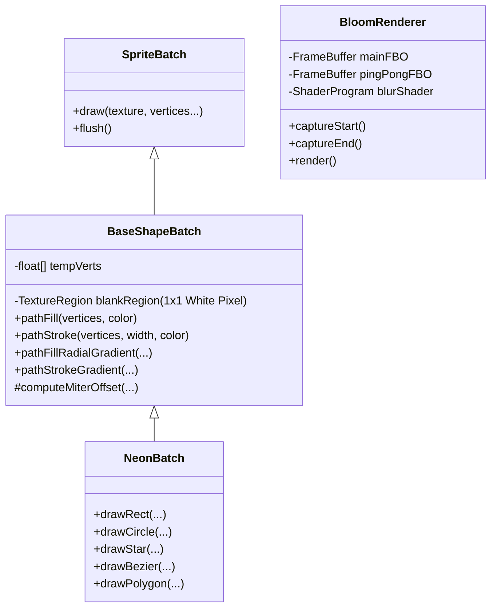

# NeonBatch 渲染系统设计文档

## 1. 系统概述
**NeonBatch** 是一个基于 LibGDX `SpriteBatch` 的高性能矢量图形绘制工具箱，专为实现 **霓虹风格 (Neon Style)** 的 2D 游戏画面而设计。
它不仅提供了丰富的几何形状绘制能力（如圆形、星形、贝塞尔曲线等），还内置了对 **辉光后处理 (Bloom)** 的支持，能够以极低的性能开销实现炫酷的发光效果。

该系统的核心优势在于：
*   **批处理渲染:** 所有的几何图形最终都转化为 `SpriteBatch` 的顶点数据，享受批处理带来的性能红利。
*   **矢量化特性:** 支持实时计算顶点，无论缩放多少倍都能保持边缘清晰（配合 Bloom 使用时效果更佳）。
*   **霓虹特效支持:** 底层算法原生支持 **双色渐变描边** 和 **中心径向渐变填充**，这是实现霓虹灯管“内白外彩”效果的关键。

---

## 2. 核心架构

### 2.1 类结构关系

### 2.2 核心渲染原理
`NeonBatch` 并不使用 OpenGL 的 `GL_LINES` 或 `GL_TRIANGLES` 直接绘制，而是利用 `SpriteBatch` 绘制纹理矩形的机制。
*   它在内存中维护了一个 1x1 的纯白像素纹理 (`blankRegion`)。
*   所有的几何形状（线段、三角形、圆）都被分解一系列带颜色的顶点。
*   这些顶点通过 `SpriteBatch.draw` 提交，映射到这个白色纹理上，利用顶点颜色（Vertex Color）实现着色。

---

## 3. BaseShapeBatch 核心算法解析

### 3.1 填充算法 (Fill)
*   **凸多边形 (Convex Polygon):** 使用 **三角扇 (Triangle Fan)** 算法。选取第一个顶点作为中心，依次连接剩余相邻的两个顶点构成三角形。
*   **扇形/星形 (Sector/Star):** 使用 `sectorFill` 方法。强制指定一个中心点（Center），所有三角形都由 Center 向外部顶点发射，这解决了凹多边形（如星形）直接使用三角扇可能导致的填充错误问题。
*   **径向渐变 (Radial Gradient):** `pathFillRadialGradient` 允许指定 `centerColor` 和 `edgeColor`。在构建三角形时，中心点赋 `centerColor`，边缘点赋 `edgeColor`，利用 GPU 插值实现平滑过渡。

### 3.2 描边算法 (Stroke)
为了绘制有宽度的线条，系统实现了 **Miter Join (斜接)** 算法：
1.  **计算法线:** 对于路径上的每个点，计算其前后线段的方向向量。
2.  **计算偏移:** 根据线宽 (`width`) 和夹角，计算出该点对应的“外侧点”和“内侧点”坐标。
3.  **构建条带:** 将相邻的内外点连接成四边形带 (`Quad Strip`)。
4.  **渐变描边:** `pathStrokeGradient` 允许分别指定线条 **内侧** 和 **外侧** 的颜色。
    *   *应用场景:* 霓虹灯管效果。设置 `innerColor = White` (全白高亮)，`outerColor = Red` (红色光晕)。

---

## 4. NeonBatch 功能详解

提供了一系列封装好的高级绘图 API，所有 API 均支持 `filled` (填充) 和 `lineWidth` (线宽) 参数。

| 方法名 | 描述 | 特殊实现 |
| :--- | :--- | :--- |
| `drawLine` | 绘制线段 | 视为 2 个顶点的路径描边。 |
| `drawRect` | 旋转矩形 | 计算中心旋转后的4个角坐标。 |
| `drawTriangle` | 三角形 | - |
| `drawPolygon` | 任意多边形 | 支持自动闭合。 |
| `drawRegularPolygon` | 正多边形 | 输入半径和边数，计算顶点。圆其实就是边数=32的正多边形。 |
| `drawStar` | 星形 | 凹多边形，必须使用 `sectorFill` 修复填充逻辑。 |
| `drawCircle` | 圆形 | 实际上是调用 `drawRegularPolygon`，建议 `segments >= 24`。 |
| `drawOval` | 椭圆 | 基于圆形的顶点计算，分别在 X/Y 轴应用不同半径。 |
| `drawArc` / `drawSector` | 圆弧/扇形 | 弧线用于通过描边画进度条；扇形用于填充画雷达图。 |
| `drawBezier` | 贝塞尔曲线 | 支持二阶/三阶贝塞尔，通过细分生成折线路径。 |

---

## 5. BloomRenderer 辉光系统

### 5.1 工作流程
1.  **Capture (捕获):** 在 `render()` 开始前调用 `captureStart()`，绑定 `mainFBO`。此时所有的渲染操作（包括 NeonBatch 的绘制）都会画到这个纹理上，而不是屏幕。
2.  **Input (输入):** 游戏逻辑调用 `neonBatch.draw...` 进行绘制。由于背景通常是透明或黑色的，只有亮的物体会被记录。
3.  **Blur (模糊处理):** `captureEnd()` 后，提取 `mainFBO` 的纹理，放入 `pingFBO`。利用 `blurShader` 进行多次高斯模糊（Ping-Pong 缓冲交换），得到一张只有“光晕”的模糊纹理。
4.  **Combine (合成):** 最后将 **原始清晰纹理** 和 **模糊光晕纹理** 叠加绘制到屏幕上。通常使用 `GL_ONE, GL_ONE` (加法混合) 来增强亮度。

### 5.2 关键参数
*   `blurScale`: 模糊降采样倍率。设为 2 或 4 可以提升性能并获得更大的光晕范围。
*   `iterations`: 模糊迭代次数。次数越多光晕越平滑，消耗越大。
*   `intensity`: 辉光强度乘数。

---

## 6. 与程序化纹理生成的关联 (预告)

NeonBatch 不仅用于实时渲染游戏画面（如子弹、特效），它也是 **NeonGenerator** (程序化纹理生成器) 的核心引擎。
*   **原理:** 利用 `FrameBuffer` 技术，并在 FBO 激活期间调用 `NeonBatch` 绘制图形。
*   **结果:** 将绘制结果保存（`getTexture().getTextureData()`）为静态的 `Texture` 或导出为 PNG 文件。
*   **优势:** 在游戏加载阶段生成 UI 资源或道具图标，极大地减小了游戏包体体积（无需预先制作大量图片）。
