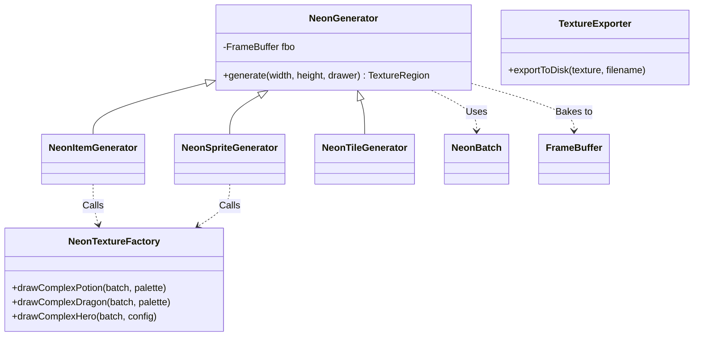

# 程序化纹理生成系统设计文档

## 1. 系统概述
**程序化纹理生成系统 (Procedural Texture Generation System)** 是一套基于 `NeonBatch` 矢量绘图能力的运行时资源生成框架。
它的核心目标是：**彻底摆脱对静态图片资源的依赖**。
在游戏启动或加载阶段，系统会根据代码逻辑动态绘制 UI 图标、物品贴图、角色动画帧以及地块纹理。

**核心优势:**
*   **无限分辨率:** 基于矢量数学公式（SDF与几何形状）绘制，可以生成任意尺寸的高清纹理（从 32x32 到 1024x1024），完美适配 4K 屏幕。
*   **极小包体:** 游戏无需包含数百张 PNG 图片，只需几 KB 的代码即可生成海量美术资源。
*   **动态换装:** 角色的装备、颜色、发型等外观完全由代码参数控制，可以组合出成千上万种不同的角色形象，而无需预先绘制对应的图片组合。
*   **风格统一:** 所有的图形都通过统一的渲染管线生成，天然保证了美术风格（Neon Style）的高度一致性。

---

## 2. 核心架构

### 2.1 模块关系图

### 2.2 核心组件
1.  **NeonGenerator (核心引擎):**
    *   **职责:** 提供绘图环境。它维护一个 `FrameBuffer` (FBO)，负责确立坐标系投影，调度 `NeonBatch` 进行绘制，并最终从 FBO 中提取出 `TextureRegion`。
    *   **单例模式:** 全局复用同一个 FBO 和 Batch，避免频繁分配内存。
    *   **坐标系投影:** 使用 `setToOrtho2D(0, 0, 1, 1)` 将绘图空间标准化为 **0.0 ~ 1.0**。这意味着无论生成的纹理是 64px 还是 512px，绘图逻辑中的坐标都是 `(0.5, 0.5)` 代表中心。

2.  **NeonTextureFactory (画师):**
    *   **职责:** 封装具体的 **"怎么画"** 的逻辑。
    *   **无状态:** 它只是一堆静态方法（如 `drawComplexPotion`），接收 `NeonBatch` 和参数对象（如 `PotionPalette`, `HeroConfig`），执行纯粹的绘图指令。

3.  **上层业务生成器:**
    *   `NeonItemGenerator`: 负责生成物品图标（剑、盾、药水）。
    *   `NeonSpriteGenerator`: 负责生成生物贴图（玩家、怪物）。
    *   `NeonTileGenerator`: 负责生成地图图块（墙壁、地板），包含自动图块逻辑。

---

## 3. 工作流程详解

### 3.1 生成流程 (The Bake Pipeline)
以生成一个 **"红色治疗药水"** 图标为例：

1.  **请求:** 业务层调用 `NeonItemGenerator.createItem("Healing Potion")`。
2.  **配置:** `ItemGenerator` 解析名字，确定应该调用 `NeonTextureFactory.drawComplexPotion`，并传入红色的 `PotionPalette`。
3.  **环境准备:** 调用 `NeonGenerator.getInstance().generate(256, 256, drawer)`。
    *   `NeonGenerator` 调整 FBO 大小至 256x256 (如有必要)。
    *   `fbo.begin()` 激活。
    *   清空屏幕 (RGBA = 0,0,0,0)。
    *   设置投影矩阵为 0~1 正交投影。
    *   `batch.begin()`。
4.  **绘制 (Vector Draw):**
    *   执行回调 `drawer`。
    *   `NeonBatch` 根据指令绘制圆形瓶身、矩形瓶颈、液面高光等。所有的坐标参数都是 0~1 之间的浮点数。
    *   `batch.end()` 提交几何数据到 GPU，GPU 渲染到 FBO 纹理。
5.  **提取 (Extract):**
    *   `NeonGenerator` 使用 `ScreenUtils.getFrameBufferPixmap` 或直接通过 `fbo.getColorBufferTexture()` 获取结果。
    *   **关键处理:** 由于 OpenGL纹理坐标系原点在左下，而 SpriteBatch 绘制 Image 时习惯左上，通常需要对生成的 TextureRegion 进行 **Y轴翻转 (FlipY)** 处理。
6.  **交付:** 返回 `TextureRegion` 给业务层使用。

### 3.2 坐标系标准化 (0-1 Normalization)
这是 V2.0 架构升级中最关键的设计。
*   **Old:** 绘制逻辑中充斥着 `x + 128`, `width - 10` 等基于像素的硬编码。一旦改变生成尺寸，所有偏移量都要重新计算。
*   **New:** 所有组件定义基于百分比。
    *   `centerX = 0.5f`
    *   `radius = 0.4f`
    *   `lineWidth = 0.02f`
*   **收益:**
    *   **LOD (Level of Detail):** 同一套绘制代码，既可以生成 32px 的背包小图标（线条自动变细），也可以生成 1024px 的展示大图（细节依然平滑）。

---

## 4. 关键实现解析

### 4.1 NeonTileGenerator 的自动图块 (Auto-tiling)
该生成器不仅是画画，还包含了 **逻辑映射**。
*   它使用 **Dual Grid** 或 **16-bit Masking** 算法。
*   `drawWallTileset` 方法会遍历 16 种可能的邻接状态（Mask 0-15）。
*   对于每种状态，它计算出对应的 Atlas 偏移坐标，并在运行时绘制出对应的墙角、墙面、顶部连接处。
*   这使得程序化生成的墙壁也能拥有类似手工像素画的自然连接感。

### 4.2 TextureExporter (调试与缓存)
虽然系统设计为运行时生成，但在开发调试阶段，或者为了优化移动端首次启动速度，我们可能需要将生成结果保存下来。
*   `exportToDisk(texture, filename)`: 将 Texture 重新绘制到一个临时 FBO，然后使用 `PixmapIO.writePNG` 写入本地磁盘。
*   这对于美术验收程序生成的 "画作" 非常有用。

---

## 5. 对比传统 SpriteGenerator
| 特性 | 像素操作生成器 (Pure Pixmap) | Neon 矢量生成器 (Base on NeonBatch) |
| :--- | :--- | :--- |
| **核心技术** | CPU 逐像素 `pixmap.drawPixel` | GPU 几何绘制 `batch.drawVertices` |
| **性能** | 慢 (CPU密集，大图生成卡顿) | 快 (GPU并行，即使画几千个形状也很快) |
| **缩放质量** | 差 (像素化或模糊) | 完美 (矢量无损) |
| **特效支持** | 难 (需手写混合算法) | 强 (原生支持 Alpha混合, 渐变, Bloom) |
| **代码复杂度** | 中 (直观但繁琐) | 高 (需要抽象几何思维) |

**结论:** `NeonGenerator` 是对旧版生成器的全面降维打击，是 MagicDungeon2 实现独特视觉风格的核心基石。
